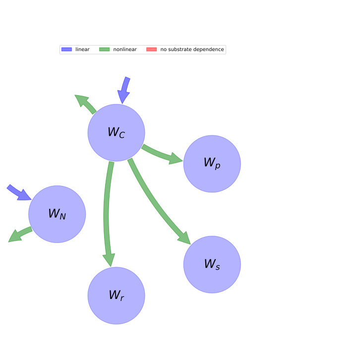

  
  
# General Overview  
  

 

This report is the result of the use of the python package bgc_md, as means to translate published models to a common language.  The underlying yaml file was created by Verónika Ceballos-Núñez (Orcid ID: 0000-0002-0046-1160) on 29/7/2015.  
  
  
  
## About the model  
  
The model depicted in this document considers carbon allocation with a process based approach. It was originally described by @Hilbert1991Annals_of_Botany.  
  
  
  
### Space Scale  
  
individual
  
  
### Available parameter values  
  
  
  
Abbreviation|Description|Source  
:-----|:-----|:-----  
set1|Original dataset of publication|@Hilbert1991Annals_of_Botany  
  Table:  Information on given parameter sets  
  
  
### Available initial values  
  
  
  
Abbreviation|Source  
:-----|:-----  
Original plots|@Hilbert1991Annals_of_Botany  
  Table:  Information on given sets of initial values  
  
  
Name|Description  
:-----|:-----  
$W_{p}$|Mass of leaf proteins  
$W_{s}$|Mass of leaf structural components  
$W_{r}$|Mass of roots  
$W_{C}$|Substrate carbon  
$W_{N}$|Substrate nitrogen  
  Table: state_variables  
  
  
Name|Description|Expression|Unit  
:-----|:-----|:-----:|:-----  
$W_{g}$|Plant biomass|$W_{g}=W_{p} + W_{r} + W_{s}$|-  
$\kappa$|growth rate coefficient|-|-  
$\sigma_{r}$|specific root activity|-|$[g N (g root)^{-1} d^{-1}]$  
$f_{C}$|Proportion of carbon|-|-  
$f_{N}$|Proportion of nitrogen|$f_{N}=\frac{W_{r}\cdot f_{C}\cdot\sigma_{r}}{A\cdot\sigma_{c}}$|-  
$B$|Target whole plant nitrogen:carbon ratio|-|-  
$f_{cp}$|Proportion of carbon in leaf proteins|-|-  
$f_{cs}$|Proportion of carbon in leaf structural components|-|-  
$f_{cr}$|Proportion of carbon in roots|-|-  
$f_{np}$|Proportion of nitrogen in leaf proteins|-|-  
$f_{ns}$|Proportion of nitrogen in leaf structural components|-|-  
$f_{nr}$|Proportion of nitrogen in roots|-|-  
$C$|Substrate carbon concentration|$C=\frac{W_{C}}{W_{g}}$|-  
$N$|Substrate nitrogen concentration|$N=\frac{W_{N}}{W_{g}}$|-  
  Table: additional_variables  
  
  
Name|Description|Expression|Unit  
:-----|:-----|:-----:|:-----  
$t$|time step|-|$day$  
$I_{dens}$|(I) photon flux density. Photosynthetically active radiation.|-|$[\mu mol\, m^{-2}\,s^{-1}]$  
$h_{max}$|leaf max. thickness|-|$[m]$  
$h_{half}$|$h_{0.5}$ leaf half thickness|-|-  
$\rho$|leaf density|-|-  
$h$|\text{None}|$h=\frac{I_{dens}\cdot h_{max}}{I_{dens} + h_{half}}$|-  
$A$|Area|$A=\frac{W_{s}}{h\cdot\rho}$|-  
$N_{a}$|Leaf nitrogen concentration|$N_{a}=\frac{W_{p}\cdot f_{np}}{A}$|$gN\cdot m^{-2}$  
$C_{i}$|Intercellular CO_2 concentration|-|$[\mu l\, l^{-1}]$  
$V_{cmax}$|Maximum carboxylation velocity|$V_{cmax}=35.76\cdot N_{a} + 12.42$|$[\mu mol CO_2\, m^{-2}\,s^{-1}]$  
$J_{max}$|Maximum rate of electron transport|$J_{max}=92.55\cdot N_{a} + 13.85$|$[\mu Eq\, m^{-2}\,s^{-1}]$  
$J$|Rate of electron transport|$J=\frac{I_{dens}\cdot J_{max}}{I_{dens} + 2.1\cdot J_{max}}$|-  
$R_{d}$|Dark respiration rate|$R_{d}=0.775\cdot N_{a} - 0.238$|$[\mu mol CO_2\, m^{-2}\,s^{-1}]$  
$A_{1}$|RuBP saturated portion of the carbon dioxide response curve|$A_{1}=- R_{d} +\frac{V_{cmax}\cdot\left(C_{i} - 31\right)}{C_{i} + 827}$|$[\mu mol CO_2\, m^{-2}\,s^{-1}]$  
$A_{2}$|RuBP limited portion of the carbon dioxide response curve|$A_{2}=\frac{J\cdot\left(C_{i} - 31\right)}{4.5\cdot C_{i} + 325.5} - R_{d}$|$[\mu mol CO_2\, m^{-2}\,s^{-1}]$  
$\sigma_{c}$|Photosynthetic rate per unit leaf|$\sigma_{c}=\min\left(A_{1}, A_{2}\right)$|-  
  Table: photosynthetic_parameters  
  
  
Name|Description|Expression|Unit  
:-----|:-----|:-----:|:-----  
$P$|\text{None}|$P=\frac{W_{r}\cdot f_{C}\cdot\sigma_{r}}{A\cdot f_{N}\cdot\sigma_{c}}$|-  
$Q$|\text{None}|$Q=\frac{f_{N}}{B\cdot f_{C}}$|-  
$\lambda_{p}$|\text{None}|$\lambda_{p}=\frac{P}{P + Q + 1}$|-  
$\lambda_{s}$|\text{None}|$\lambda_{s}=\frac{Q}{P + Q + 1}$|-  
$\lambda_{r}$|\text{None}|$\lambda_{r}=\frac{1}{P + Q + 1}$|-  
  Table: allocation_coefficients  
  
  
Name|Description|Expression  
:-----|:-----|:-----:  
$x$|vector of states for vegetation|$x=\left[\begin{matrix}W_{N}\\W_{C}\\W_{p}\\W_{s}\\W_{r}\end{matrix}\right]$  
$u$|scalar function of photosynthetic inputs|$u=\left[\begin{matrix}A\cdot\sigma_{c}\\W_{r}\cdot\sigma_{r}\\0\\0\\0\end{matrix}\right]$  
$b$|partitioning coefficient of system inputs|$b=1$  
$A_{x}$|matrix of turnover (cycling) rates|$A_{x}=\left[\begin{matrix}\frac{W_{N}\cdot\kappa\cdot\left(- W_{p}\cdot f_{cp}\cdot\lambda_{p} - W_{r}\cdot f_{cr}\cdot\lambda_{r} - W_{s}\cdot f_{cs}\cdot\lambda_{s}\right)}{W_{g}^{2}} & 0 & 0 & 0 & 0\\0 &\frac{W_{C}\cdot\kappa\cdot\left(- W_{p}\cdot f_{np}\cdot\lambda_{p} - W_{r}\cdot f_{nr}\cdot\lambda_{r} - W_{s}\cdot f_{ns}\cdot\lambda_{s}\right)}{W_{g}^{2}} & 0 & 0 & 0\\0 &\frac{N\cdot W_{p}\cdot\kappa\cdot\lambda_{p}}{W_{g}} & 0 & 0 & 0\\0 &\frac{N\cdot W_{s}\cdot\kappa\cdot\lambda_{s}}{W_{g}} & 0 & 0 & 0\\0 &\frac{N\cdot W_{r}\cdot\kappa\cdot\lambda_{r}}{W_{g}} & 0 & 0 & 0\end{matrix}\right]$  
$f_{v}$|the righthandside of the ode|$f_{v}=b u + A_{x} x$  
  Table: components  
  
  
## Pool model representation  
  

 

 **Figure 1:** *Pool model representation* 

  
  
#### Input fluxes  
  
$W_{N}: \frac{W_{s}\cdot\left(I_{dens} + h_{half}\right)\cdot\min\left(-\frac{0.775\cdot I_{dens}\cdot W_{p}\cdot f_{np}\cdot h_{max}\cdot\rho}{W_{s}\cdot\left(I_{dens} + h_{half}\right)} +\frac{\left(C_{i} - 31\right)\cdot\left(\frac{35.76\cdot I_{dens}\cdot W_{p}\cdot f_{np}\cdot h_{max}\cdot\rho}{W_{s}\cdot\left(I_{dens} + h_{half}\right)} + 12.42\right)}{C_{i} + 827} + 0.238, -\frac{0.775\cdot I_{dens}\cdot W_{p}\cdot f_{np}\cdot h_{max}\cdot\rho}{W_{s}\cdot\left(I_{dens} + h_{half}\right)} +\frac{I_{dens}\cdot\left(C_{i} - 31\right)\cdot\left(\frac{92.55\cdot I_{dens}\cdot W_{p}\cdot f_{np}\cdot h_{max}\cdot\rho}{W_{s}\cdot\left(I_{dens} + h_{half}\right)} + 13.85\right)}{\left(4.5\cdot C_{i} + 325.5\right)\cdot\left(\frac{194.355\cdot I_{dens}\cdot W_{p}\cdot f_{np}\cdot h_{max}\cdot\rho}{W_{s}\cdot\left(I_{dens} + h_{half}\right)} + I_{dens} + 29.085\right)} + 0.238\right)}{I_{dens}\cdot h_{max}\cdot\rho}$  
$W_{C}: W_{r}\cdot\sigma_{r}$  

  
  
#### Output fluxes  
  
$W_{N}: \frac{W_{N}^{2}\cdot W_{s}\cdot\kappa\cdot\left(B\cdot W_{p}\cdot f_{cp}\cdot\left(I_{dens} + h_{half}\right)\cdot\min\left(\frac{- 0.775\cdot I_{dens}\cdot W_{p}\cdot f_{np}\cdot h_{max}\cdot\rho\cdot\left(C_{i} + 827\right) + W_{s}\cdot\left(0.238\cdot C_{i} + 196.826\right)\cdot\left(I_{dens} + h_{half}\right) +\left(C_{i} - 31\right)\cdot\left(35.76\cdot I_{dens}\cdot W_{p}\cdot f_{np}\cdot h_{max}\cdot\rho + 12.42\cdot W_{s}\cdot\left(I_{dens} + h_{half}\right)\right)}{W_{s}\cdot\left(C_{i} + 827\right)\cdot\left(I_{dens} + h_{half}\right)},\frac{- 0.775\cdot I_{dens}\cdot W_{p}\cdot f_{np}\cdot h_{max}\cdot\rho\cdot\left(4.5\cdot C_{i} + 325.5\right)\cdot\left(194.355\cdot I_{dens}\cdot W_{p}\cdot f_{np}\cdot h_{max}\cdot\rho + W_{s}\cdot\left(I_{dens} + 29.085\right)\cdot\left(I_{dens} + h_{half}\right)\right) + I_{dens}\cdot W_{s}\cdot\left(C_{i} - 31\right)\cdot\left(I_{dens} + h_{half}\right)\cdot\left(92.55\cdot I_{dens}\cdot W_{p}\cdot f_{np}\cdot h_{max}\cdot\rho + 13.85\cdot W_{s}\cdot\left(I_{dens} + h_{half}\right)\right) + 0.238\cdot W_{s}\cdot\left(4.5\cdot C_{i} + 325.5\right)\cdot\left(I_{dens} + h_{half}\right)\cdot\left(194.355\cdot I_{dens}\cdot W_{p}\cdot f_{np}\cdot h_{max}\cdot\rho + W_{s}\cdot\left(I_{dens} + 29.085\right)\cdot\left(I_{dens} + h_{half}\right)\right)}{W_{s}\cdot\left(4.5\cdot C_{i} + 325.5\right)\cdot\left(I_{dens} + h_{half}\right)\cdot\left(194.355\cdot I_{dens}\cdot W_{p}\cdot f_{np}\cdot h_{max}\cdot\rho + W_{s}\cdot\left(I_{dens} + 29.085\right)\cdot\left(I_{dens} + h_{half}\right)\right)}\right) + B\cdot W_{r}\cdot f_{cr}\cdot\left(I_{dens} + h_{half}\right)\cdot\min\left(\frac{- 0.775\cdot I_{dens}\cdot W_{p}\cdot f_{np}\cdot h_{max}\cdot\rho\cdot\left(C_{i} + 827\right) + W_{s}\cdot\left(0.238\cdot C_{i} + 196.826\right)\cdot\left(I_{dens} + h_{half}\right) +\left(C_{i} - 31\right)\cdot\left(35.76\cdot I_{dens}\cdot W_{p}\cdot f_{np}\cdot h_{max}\cdot\rho + 12.42\cdot W_{s}\cdot\left(I_{dens} + h_{half}\right)\right)}{W_{s}\cdot\left(C_{i} + 827\right)\cdot\left(I_{dens} + h_{half}\right)},\frac{- 0.775\cdot I_{dens}\cdot W_{p}\cdot f_{np}\cdot h_{max}\cdot\rho\cdot\left(4.5\cdot C_{i} + 325.5\right)\cdot\left(194.355\cdot I_{dens}\cdot W_{p}\cdot f_{np}\cdot h_{max}\cdot\rho + W_{s}\cdot\left(I_{dens} + 29.085\right)\cdot\left(I_{dens} + h_{half}\right)\right) + I_{dens}\cdot W_{s}\cdot\left(C_{i} - 31\right)\cdot\left(I_{dens} + h_{half}\right)\cdot\left(92.55\cdot I_{dens}\cdot W_{p}\cdot f_{np}\cdot h_{max}\cdot\rho + 13.85\cdot W_{s}\cdot\left(I_{dens} + h_{half}\right)\right) + 0.238\cdot W_{s}\cdot\left(4.5\cdot C_{i} + 325.5\right)\cdot\left(I_{dens} + h_{half}\right)\cdot\left(194.355\cdot I_{dens}\cdot W_{p}\cdot f_{np}\cdot h_{max}\cdot\rho + W_{s}\cdot\left(I_{dens} + 29.085\right)\cdot\left(I_{dens} + h_{half}\right)\right)}{W_{s}\cdot\left(4.5\cdot C_{i} + 325.5\right)\cdot\left(I_{dens} + h_{half}\right)\cdot\left(194.355\cdot I_{dens}\cdot W_{p}\cdot f_{np}\cdot h_{max}\cdot\rho + W_{s}\cdot\left(I_{dens} + 29.085\right)\cdot\left(I_{dens} + h_{half}\right)\right)}\right) + I_{dens}\cdot W_{r}\cdot f_{cs}\cdot h_{max}\cdot\rho\cdot\sigma_{r}\right)}{\left(2\cdot B\cdot W_{s}\cdot\left(I_{dens} + h_{half}\right)\cdot\min\left(\frac{- 0.775\cdot I_{dens}\cdot W_{p}\cdot f_{np}\cdot h_{max}\cdot\rho\cdot\left(C_{i} + 827\right) + W_{s}\cdot\left(0.238\cdot C_{i} + 196.826\right)\cdot\left(I_{dens} + h_{half}\right) +\left(C_{i} - 31\right)\cdot\left(35.76\cdot I_{dens}\cdot W_{p}\cdot f_{np}\cdot h_{max}\cdot\rho + 12.42\cdot W_{s}\cdot\left(I_{dens} + h_{half}\right)\right)}{W_{s}\cdot\left(C_{i} + 827\right)\cdot\left(I_{dens} + h_{half}\right)},\frac{- 0.775\cdot I_{dens}\cdot W_{p}\cdot f_{np}\cdot h_{max}\cdot\rho\cdot\left(4.5\cdot C_{i} + 325.5\right)\cdot\left(194.355\cdot I_{dens}\cdot W_{p}\cdot f_{np}\cdot h_{max}\cdot\rho + W_{s}\cdot\left(I_{dens} + 29.085\right)\cdot\left(I_{dens} + h_{half}\right)\right) + I_{dens}\cdot W_{s}\cdot\left(C_{i} - 31\right)\cdot\left(I_{dens} + h_{half}\right)\cdot\left(92.55\cdot I_{dens}\cdot W_{p}\cdot f_{np}\cdot h_{max}\cdot\rho + 13.85\cdot W_{s}\cdot\left(I_{dens} + h_{half}\right)\right) + 0.238\cdot W_{s}\cdot\left(4.5\cdot C_{i} + 325.5\right)\cdot\left(I_{dens} + h_{half}\right)\cdot\left(194.355\cdot I_{dens}\cdot W_{p}\cdot f_{np}\cdot h_{max}\cdot\rho + W_{s}\cdot\left(I_{dens} + 29.085\right)\cdot\left(I_{dens} + h_{half}\right)\right)}{W_{s}\cdot\left(4.5\cdot C_{i} + 325.5\right)\cdot\left(I_{dens} + h_{half}\right)\cdot\left(194.355\cdot I_{dens}\cdot W_{p}\cdot f_{np}\cdot h_{max}\cdot\rho + W_{s}\cdot\left(I_{dens} + 29.085\right)\cdot\left(I_{dens} + h_{half}\right)\right)}\right) + I_{dens}\cdot W_{r}\cdot h_{max}\cdot\rho\cdot\sigma_{r}\right)\cdot\left(W_{p} + W_{r} + W_{s}\right)^{2}}$  
$W_{C}: -\frac{W_{C}\cdot W_{s}\cdot\kappa\cdot\left(B\cdot W_{N}\cdot W_{p}\cdot\left(I_{dens} + h_{half}\right)\cdot\min\left(\frac{- 0.775\cdot I_{dens}\cdot W_{p}\cdot f_{np}\cdot h_{max}\cdot\rho\cdot\left(C_{i} + 827\right) + W_{s}\cdot\left(0.238\cdot C_{i} + 196.826\right)\cdot\left(I_{dens} + h_{half}\right) +\left(C_{i} - 31\right)\cdot\left(35.76\cdot I_{dens}\cdot W_{p}\cdot f_{np}\cdot h_{max}\cdot\rho + 12.42\cdot W_{s}\cdot\left(I_{dens} + h_{half}\right)\right)}{W_{s}\cdot\left(C_{i} + 827\right)\cdot\left(I_{dens} + h_{half}\right)},\frac{- 0.775\cdot I_{dens}\cdot W_{p}\cdot f_{np}\cdot h_{max}\cdot\rho\cdot\left(4.5\cdot C_{i} + 325.5\right)\cdot\left(194.355\cdot I_{dens}\cdot W_{p}\cdot f_{np}\cdot h_{max}\cdot\rho + W_{s}\cdot\left(I_{dens} + 29.085\right)\cdot\left(I_{dens} + h_{half}\right)\right) + I_{dens}\cdot W_{s}\cdot\left(C_{i} - 31\right)\cdot\left(I_{dens} + h_{half}\right)\cdot\left(92.55\cdot I_{dens}\cdot W_{p}\cdot f_{np}\cdot h_{max}\cdot\rho + 13.85\cdot W_{s}\cdot\left(I_{dens} + h_{half}\right)\right) + 0.238\cdot W_{s}\cdot\left(4.5\cdot C_{i} + 325.5\right)\cdot\left(I_{dens} + h_{half}\right)\cdot\left(194.355\cdot I_{dens}\cdot W_{p}\cdot f_{np}\cdot h_{max}\cdot\rho + W_{s}\cdot\left(I_{dens} + 29.085\right)\cdot\left(I_{dens} + h_{half}\right)\right)}{W_{s}\cdot\left(4.5\cdot C_{i} + 325.5\right)\cdot\left(I_{dens} + h_{half}\right)\cdot\left(194.355\cdot I_{dens}\cdot W_{p}\cdot f_{np}\cdot h_{max}\cdot\rho + W_{s}\cdot\left(I_{dens} + 29.085\right)\cdot\left(I_{dens} + h_{half}\right)\right)}\right) + B\cdot W_{N}\cdot W_{r}\cdot\left(I_{dens} + h_{half}\right)\cdot\min\left(\frac{- 0.775\cdot I_{dens}\cdot W_{p}\cdot f_{np}\cdot h_{max}\cdot\rho\cdot\left(C_{i} + 827\right) + W_{s}\cdot\left(0.238\cdot C_{i} + 196.826\right)\cdot\left(I_{dens} + h_{half}\right) +\left(C_{i} - 31\right)\cdot\left(35.76\cdot I_{dens}\cdot W_{p}\cdot f_{np}\cdot h_{max}\cdot\rho + 12.42\cdot W_{s}\cdot\left(I_{dens} + h_{half}\right)\right)}{W_{s}\cdot\left(C_{i} + 827\right)\cdot\left(I_{dens} + h_{half}\right)},\frac{- 0.775\cdot I_{dens}\cdot W_{p}\cdot f_{np}\cdot h_{max}\cdot\rho\cdot\left(4.5\cdot C_{i} + 325.5\right)\cdot\left(194.355\cdot I_{dens}\cdot W_{p}\cdot f_{np}\cdot h_{max}\cdot\rho + W_{s}\cdot\left(I_{dens} + 29.085\right)\cdot\left(I_{dens} + h_{half}\right)\right) + I_{dens}\cdot W_{s}\cdot\left(C_{i} - 31\right)\cdot\left(I_{dens} + h_{half}\right)\cdot\left(92.55\cdot I_{dens}\cdot W_{p}\cdot f_{np}\cdot h_{max}\cdot\rho + 13.85\cdot W_{s}\cdot\left(I_{dens} + h_{half}\right)\right) + 0.238\cdot W_{s}\cdot\left(4.5\cdot C_{i} + 325.5\right)\cdot\left(I_{dens} + h_{half}\right)\cdot\left(194.355\cdot I_{dens}\cdot W_{p}\cdot f_{np}\cdot h_{max}\cdot\rho + W_{s}\cdot\left(I_{dens} + 29.085\right)\cdot\left(I_{dens} + h_{half}\right)\right)}{W_{s}\cdot\left(4.5\cdot C_{i} + 325.5\right)\cdot\left(I_{dens} + h_{half}\right)\cdot\left(194.355\cdot I_{dens}\cdot W_{p}\cdot f_{np}\cdot h_{max}\cdot\rho + W_{s}\cdot\left(I_{dens} + 29.085\right)\cdot\left(I_{dens} + h_{half}\right)\right)}\right) + I_{dens}\cdot W_{N}\cdot W_{r}\cdot h_{max}\cdot\rho\cdot\sigma_{r} - W_{C}\cdot\left(B\cdot W_{p}\cdot f_{np}\cdot\left(I_{dens} + h_{half}\right)\cdot\min\left(\frac{- 0.775\cdot I_{dens}\cdot W_{p}\cdot f_{np}\cdot h_{max}\cdot\rho\cdot\left(C_{i} + 827\right) + W_{s}\cdot\left(0.238\cdot C_{i} + 196.826\right)\cdot\left(I_{dens} + h_{half}\right) +\left(C_{i} - 31\right)\cdot\left(35.76\cdot I_{dens}\cdot W_{p}\cdot f_{np}\cdot h_{max}\cdot\rho + 12.42\cdot W_{s}\cdot\left(I_{dens} + h_{half}\right)\right)}{W_{s}\cdot\left(C_{i} + 827\right)\cdot\left(I_{dens} + h_{half}\right)},\frac{- 0.775\cdot I_{dens}\cdot W_{p}\cdot f_{np}\cdot h_{max}\cdot\rho\cdot\left(4.5\cdot C_{i} + 325.5\right)\cdot\left(194.355\cdot I_{dens}\cdot W_{p}\cdot f_{np}\cdot h_{max}\cdot\rho + W_{s}\cdot\left(I_{dens} + 29.085\right)\cdot\left(I_{dens} + h_{half}\right)\right) + I_{dens}\cdot W_{s}\cdot\left(C_{i} - 31\right)\cdot\left(I_{dens} + h_{half}\right)\cdot\left(92.55\cdot I_{dens}\cdot W_{p}\cdot f_{np}\cdot h_{max}\cdot\rho + 13.85\cdot W_{s}\cdot\left(I_{dens} + h_{half}\right)\right) + 0.238\cdot W_{s}\cdot\left(4.5\cdot C_{i} + 325.5\right)\cdot\left(I_{dens} + h_{half}\right)\cdot\left(194.355\cdot I_{dens}\cdot W_{p}\cdot f_{np}\cdot h_{max}\cdot\rho + W_{s}\cdot\left(I_{dens} + 29.085\right)\cdot\left(I_{dens} + h_{half}\right)\right)}{W_{s}\cdot\left(4.5\cdot C_{i} + 325.5\right)\cdot\left(I_{dens} + h_{half}\right)\cdot\left(194.355\cdot I_{dens}\cdot W_{p}\cdot f_{np}\cdot h_{max}\cdot\rho + W_{s}\cdot\left(I_{dens} + 29.085\right)\cdot\left(I_{dens} + h_{half}\right)\right)}\right) + B\cdot W_{r}\cdot f_{nr}\cdot\left(I_{dens} + h_{half}\right)\cdot\min\left(\frac{- 0.775\cdot I_{dens}\cdot W_{p}\cdot f_{np}\cdot h_{max}\cdot\rho\cdot\left(C_{i} + 827\right) + W_{s}\cdot\left(0.238\cdot C_{i} + 196.826\right)\cdot\left(I_{dens} + h_{half}\right) +\left(C_{i} - 31\right)\cdot\left(35.76\cdot I_{dens}\cdot W_{p}\cdot f_{np}\cdot h_{max}\cdot\rho + 12.42\cdot W_{s}\cdot\left(I_{dens} + h_{half}\right)\right)}{W_{s}\cdot\left(C_{i} + 827\right)\cdot\left(I_{dens} + h_{half}\right)},\frac{- 0.775\cdot I_{dens}\cdot W_{p}\cdot f_{np}\cdot h_{max}\cdot\rho\cdot\left(4.5\cdot C_{i} + 325.5\right)\cdot\left(194.355\cdot I_{dens}\cdot W_{p}\cdot f_{np}\cdot h_{max}\cdot\rho + W_{s}\cdot\left(I_{dens} + 29.085\right)\cdot\left(I_{dens} + h_{half}\right)\right) + I_{dens}\cdot W_{s}\cdot\left(C_{i} - 31\right)\cdot\left(I_{dens} + h_{half}\right)\cdot\left(92.55\cdot I_{dens}\cdot W_{p}\cdot f_{np}\cdot h_{max}\cdot\rho + 13.85\cdot W_{s}\cdot\left(I_{dens} + h_{half}\right)\right) + 0.238\cdot W_{s}\cdot\left(4.5\cdot C_{i} + 325.5\right)\cdot\left(I_{dens} + h_{half}\right)\cdot\left(194.355\cdot I_{dens}\cdot W_{p}\cdot f_{np}\cdot h_{max}\cdot\rho + W_{s}\cdot\left(I_{dens} + 29.085\right)\cdot\left(I_{dens} + h_{half}\right)\right)}{W_{s}\cdot\left(4.5\cdot C_{i} + 325.5\right)\cdot\left(I_{dens} + h_{half}\right)\cdot\left(194.355\cdot I_{dens}\cdot W_{p}\cdot f_{np}\cdot h_{max}\cdot\rho + W_{s}\cdot\left(I_{dens} + 29.085\right)\cdot\left(I_{dens} + h_{half}\right)\right)}\right) + I_{dens}\cdot W_{r}\cdot f_{ns}\cdot h_{max}\cdot\rho\cdot\sigma_{r}\right)\right)}{\left(2\cdot B\cdot W_{s}\cdot\left(I_{dens} + h_{half}\right)\cdot\min\left(\frac{- 0.775\cdot I_{dens}\cdot W_{p}\cdot f_{np}\cdot h_{max}\cdot\rho\cdot\left(C_{i} + 827\right) + W_{s}\cdot\left(0.238\cdot C_{i} + 196.826\right)\cdot\left(I_{dens} + h_{half}\right) +\left(C_{i} - 31\right)\cdot\left(35.76\cdot I_{dens}\cdot W_{p}\cdot f_{np}\cdot h_{max}\cdot\rho + 12.42\cdot W_{s}\cdot\left(I_{dens} + h_{half}\right)\right)}{W_{s}\cdot\left(C_{i} + 827\right)\cdot\left(I_{dens} + h_{half}\right)},\frac{- 0.775\cdot I_{dens}\cdot W_{p}\cdot f_{np}\cdot h_{max}\cdot\rho\cdot\left(4.5\cdot C_{i} + 325.5\right)\cdot\left(194.355\cdot I_{dens}\cdot W_{p}\cdot f_{np}\cdot h_{max}\cdot\rho + W_{s}\cdot\left(I_{dens} + 29.085\right)\cdot\left(I_{dens} + h_{half}\right)\right) + I_{dens}\cdot W_{s}\cdot\left(C_{i} - 31\right)\cdot\left(I_{dens} + h_{half}\right)\cdot\left(92.55\cdot I_{dens}\cdot W_{p}\cdot f_{np}\cdot h_{max}\cdot\rho + 13.85\cdot W_{s}\cdot\left(I_{dens} + h_{half}\right)\right) + 0.238\cdot W_{s}\cdot\left(4.5\cdot C_{i} + 325.5\right)\cdot\left(I_{dens} + h_{half}\right)\cdot\left(194.355\cdot I_{dens}\cdot W_{p}\cdot f_{np}\cdot h_{max}\cdot\rho + W_{s}\cdot\left(I_{dens} + 29.085\right)\cdot\left(I_{dens} + h_{half}\right)\right)}{W_{s}\cdot\left(4.5\cdot C_{i} + 325.5\right)\cdot\left(I_{dens} + h_{half}\right)\cdot\left(194.355\cdot I_{dens}\cdot W_{p}\cdot f_{np}\cdot h_{max}\cdot\rho + W_{s}\cdot\left(I_{dens} + 29.085\right)\cdot\left(I_{dens} + h_{half}\right)\right)}\right) + I_{dens}\cdot W_{r}\cdot h_{max}\cdot\rho\cdot\sigma_{r}\right)\cdot\left(W_{p} + W_{r} + W_{s}\right)^{2}}$  

  
  
#### Internal fluxes  
  
$W_{C} \rightarrow W_{p}: \frac{W_{C}\cdot W_{N}\cdot W_{p}\cdot\kappa}{\left(2 +\frac{I_{dens}\cdot W_{r}\cdot h_{max}\cdot\rho\cdot\sigma_{r}}{B\cdot W_{s}\cdot\left(I_{dens} + h_{half}\right)\cdot\min\left(-\frac{0.775\cdot I_{dens}\cdot W_{p}\cdot f_{np}\cdot h_{max}\cdot\rho}{W_{s}\cdot\left(I_{dens} + h_{half}\right)} +\frac{\left(C_{i} - 31\right)\cdot\left(\frac{35.76\cdot I_{dens}\cdot W_{p}\cdot f_{np}\cdot h_{max}\cdot\rho}{W_{s}\cdot\left(I_{dens} + h_{half}\right)} + 12.42\right)}{C_{i} + 827} + 0.238, -\frac{0.775\cdot I_{dens}\cdot W_{p}\cdot f_{np}\cdot h_{max}\cdot\rho}{W_{s}\cdot\left(I_{dens} + h_{half}\right)} +\frac{I_{dens}\cdot\left(C_{i} - 31\right)\cdot\left(\frac{92.55\cdot I_{dens}\cdot W_{p}\cdot f_{np}\cdot h_{max}\cdot\rho}{W_{s}\cdot\left(I_{dens} + h_{half}\right)} + 13.85\right)}{\left(4.5\cdot C_{i} + 325.5\right)\cdot\left(\frac{194.355\cdot I_{dens}\cdot W_{p}\cdot f_{np}\cdot h_{max}\cdot\rho}{W_{s}\cdot\left(I_{dens} + h_{half}\right)} + I_{dens} + 29.085\right)} + 0.238\right)}\right)\cdot\left(W_{p} + W_{r} + W_{s}\right)^{2}}$  
$W_{C} \rightarrow W_{s}: \frac{I_{dens}\cdot W_{C}\cdot W_{N}\cdot W_{r}\cdot W_{s}\cdot h_{max}\cdot\kappa\cdot\rho\cdot\sigma_{r}}{\left(2\cdot B\cdot W_{s}\cdot\left(I_{dens} + h_{half}\right)\cdot\min\left(\frac{- 0.775\cdot I_{dens}\cdot W_{p}\cdot f_{np}\cdot h_{max}\cdot\rho\cdot\left(C_{i} + 827\right) + W_{s}\cdot\left(0.238\cdot C_{i} + 196.826\right)\cdot\left(I_{dens} + h_{half}\right) +\left(C_{i} - 31\right)\cdot\left(35.76\cdot I_{dens}\cdot W_{p}\cdot f_{np}\cdot h_{max}\cdot\rho + 12.42\cdot W_{s}\cdot\left(I_{dens} + h_{half}\right)\right)}{W_{s}\cdot\left(C_{i} + 827\right)\cdot\left(I_{dens} + h_{half}\right)},\frac{- 0.775\cdot I_{dens}\cdot W_{p}\cdot f_{np}\cdot h_{max}\cdot\rho\cdot\left(4.5\cdot C_{i} + 325.5\right)\cdot\left(194.355\cdot I_{dens}\cdot W_{p}\cdot f_{np}\cdot h_{max}\cdot\rho + W_{s}\cdot\left(I_{dens} + 29.085\right)\cdot\left(I_{dens} + h_{half}\right)\right) + I_{dens}\cdot W_{s}\cdot\left(C_{i} - 31\right)\cdot\left(I_{dens} + h_{half}\right)\cdot\left(92.55\cdot I_{dens}\cdot W_{p}\cdot f_{np}\cdot h_{max}\cdot\rho + 13.85\cdot W_{s}\cdot\left(I_{dens} + h_{half}\right)\right) + 0.238\cdot W_{s}\cdot\left(4.5\cdot C_{i} + 325.5\right)\cdot\left(I_{dens} + h_{half}\right)\cdot\left(194.355\cdot I_{dens}\cdot W_{p}\cdot f_{np}\cdot h_{max}\cdot\rho + W_{s}\cdot\left(I_{dens} + 29.085\right)\cdot\left(I_{dens} + h_{half}\right)\right)}{W_{s}\cdot\left(4.5\cdot C_{i} + 325.5\right)\cdot\left(I_{dens} + h_{half}\right)\cdot\left(194.355\cdot I_{dens}\cdot W_{p}\cdot f_{np}\cdot h_{max}\cdot\rho + W_{s}\cdot\left(I_{dens} + 29.085\right)\cdot\left(I_{dens} + h_{half}\right)\right)}\right) + I_{dens}\cdot W_{r}\cdot h_{max}\cdot\rho\cdot\sigma_{r}\right)\cdot\left(W_{p} + W_{r} + W_{s}\right)^{2}}$  
$W_{C} \rightarrow W_{r}: \frac{W_{C}\cdot W_{N}\cdot W_{r}\cdot\kappa}{\left(2 +\frac{I_{dens}\cdot W_{r}\cdot h_{max}\cdot\rho\cdot\sigma_{r}}{B\cdot W_{s}\cdot\left(I_{dens} + h_{half}\right)\cdot\min\left(-\frac{0.775\cdot I_{dens}\cdot W_{p}\cdot f_{np}\cdot h_{max}\cdot\rho}{W_{s}\cdot\left(I_{dens} + h_{half}\right)} +\frac{\left(C_{i} - 31\right)\cdot\left(\frac{35.76\cdot I_{dens}\cdot W_{p}\cdot f_{np}\cdot h_{max}\cdot\rho}{W_{s}\cdot\left(I_{dens} + h_{half}\right)} + 12.42\right)}{C_{i} + 827} + 0.238, -\frac{0.775\cdot I_{dens}\cdot W_{p}\cdot f_{np}\cdot h_{max}\cdot\rho}{W_{s}\cdot\left(I_{dens} + h_{half}\right)} +\frac{I_{dens}\cdot\left(C_{i} - 31\right)\cdot\left(\frac{92.55\cdot I_{dens}\cdot W_{p}\cdot f_{np}\cdot h_{max}\cdot\rho}{W_{s}\cdot\left(I_{dens} + h_{half}\right)} + 13.85\right)}{\left(4.5\cdot C_{i} + 325.5\right)\cdot\left(\frac{194.355\cdot I_{dens}\cdot W_{p}\cdot f_{np}\cdot h_{max}\cdot\rho}{W_{s}\cdot\left(I_{dens} + h_{half}\right)} + I_{dens} + 29.085\right)} + 0.238\right)}\right)\cdot\left(W_{p} + W_{r} + W_{s}\right)^{2}}$  
  
  
## References  
  
