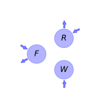

  
  
# General Overview  
  

 

This report is the result of the use of the python package bgc_md, as means to translate published models to a common language.  The underlying yaml file was created by Verónika Ceballos-Núñez (Orcid ID: 0000-0002-0046-1160) on 29/7/2015.  
  
  
  
## About the model  
  
The model depicted in this document considers carbon allocation with a process based approach. It was originally described by @King1993TreePhysiology.  
  
  
  
### Space Scale  
  
forest
  
  
### Available parameter values  
  
  
  
Abbreviation|Source  
:-----|:-----  
Chosen based on the performance of Pinus radiata at Puruki, New Zeland|@King1993TreePhysiology  
  Table:  Information on given parameter sets  
  
  
Name|Description|Unit  
:-----|:-----|:-----  
$F$|Foliage dry mass|$kgC\cdot m^{-2}$  
$R$|Fine roots dry mass|$kgC\cdot m^{-2}$  
$W$|Woody tissue dry mass|$kgC\cdot m^{-2}$  
  Table: state_variables  
  
  
Name|Description|Expression|Unit  
:-----|:-----|:-----:|:-----  
$k$|Radiation extinction coefficient of canopy|-|-  
$\Phi_{0}$|Incident PAR|-|$MJ\cdot m\cdot ^{-2}\cdot year^{-1}$  
$\omega$|Specific leaf area|-|$m\cdot ^2\cdot kg^{-1}$  
$\Phi$|Annual photosynthetically active radiation (PAR) intercepted by the canopy|$\Phi=\Phi_{0}\cdot\left(1 - e^{- F\cdot k\cdot\omega}\right)$|$MJ\cdot m\cdot ^{-2}\cdot year^{-1}$  
$\epsilon$|Light utilization coefficient|-|$kg\cdot MJ^{-1}$  
$G$|Rate of biomass production per unit ground area|$G=\Phi\cdot\epsilon$|$kg\cdot m^{-2}\cdot year^{-1}$  
  Table: photosynthetic_parameters  
  
  
Name|Description|Expression  
:-----|:-----|:-----:  
$\eta_{f}$|Fraction of biomass production partitioned to leaves|-  
$\eta_{r}$|Fraction of biomass production partitioned to roots|-  
$\eta_{w}$|Fraction of biomass production partitioned to wood|$\eta_{w}=-\eta_{f} -\eta_{r} + 1$  
  Table: allocation_coefficients  
  
  
Name|Description|Unit  
:-----|:-----|:-----  
$\gamma_{f}$|Senescence rate per unit foliage biomass|$kg^{-1}$  
$\gamma_{r}$|Senescence rate per unit fine roots biomass|$kg^{-1}$  
  Table: cycling_rates  
  
  
Name|Description|Expression  
:-----|:-----|:-----:  
$x$|vector of states for vegetation|$x=\left[\begin{matrix}F\\R\\W\end{matrix}\right]$  
$u$|scalar function of photosynthetic inputs|$u=G$  
$b$|vector of partitioning coefficients of photosynthetically fixed carbon|$b=\left[\begin{matrix}\eta_{f}\\\eta_{r}\\\eta_{w}\end{matrix}\right]$  
$A$|matrix of turnover (cycling) rates|$A=\left[\begin{matrix}-\gamma_{f} & 0 & 0\\0 & -\gamma_{r} & 0\\0 & 0 & 0\end{matrix}\right]$  
$f_{v}$|the righthandside of the ode|$f_{v}=u b + A x$  
  Table: components  
  
  
## Pool model representation  
  

 

 **Figure 1:** *Pool model representation* 

  
  
#### Input fluxes  
  
$F: \Phi_{0}\cdot\epsilon\cdot\eta_{f}\cdot\left(1 - e^{- F\cdot k\cdot\omega}\right)$  
$R: \Phi_{0}\cdot\epsilon\cdot\eta_{r}\cdot\left(1 - e^{- F\cdot k\cdot\omega}\right)$  
$W: \Phi_{0}\cdot\epsilon\cdot\left(1 - e^{- F\cdot k\cdot\omega}\right)\cdot\left(-\eta_{f} -\eta_{r} + 1\right)$  

  
  
#### Output fluxes  
  
$F: F\cdot\gamma_{f}$  
$R: R\cdot\gamma_{r}$  
  
  
## Steady state formulas  
  
$F = 0$  
  
  
  
$R = 0$  
  
  
  
$W = W$  
  
  
  
  
  
## References  
  
