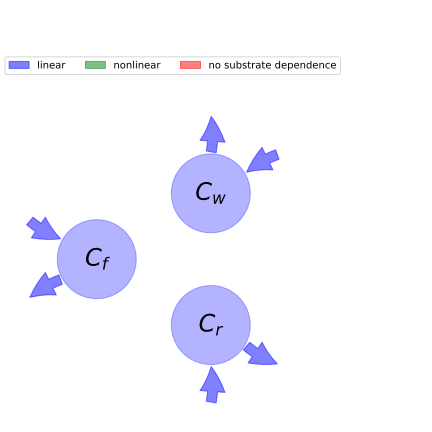

  
  
# General Overview  
  

 

This report is the result of the use of the python package bgc_md, as means to translate published models to a common language.  The underlying yaml file was created by Verónika Ceballos-Núñez (Orcid ID: 0000-0002-0046-1160) on 24/3/2016.  
  
  
  
## About the model  
  
The model depicted in this document considers carbon allocation with a process based approach. It was originally described by @Luo2012TE.  
  
  
  
### Space Scale  
  
global
  
  
### Available parameter values  
  
  
  
Abbreviation|Description  
:-----|:-----  
set1|Original parameters of the publication. Parameter value of GPP corresponds to an annual average  
  Table:  Information on given parameter sets  
  
  
### Available initial values  
  
  
  
Abbreviation|Description  
:-----|:-----  
_0|original dataset of the publication. Parameter value of GPP corresponds to an annual average  
  Table:  Information on given sets of initial values  
  
  
Name|Description  
:-----|:-----  
$C_{f}$|Carbon in foliage  
$C_{r}$|Carbon in roots  
$C_{w}$|Carbon in woody tissue  
  Table: state_variables  
  
  
Name|Description|Expression|Unit  
:-----|:-----|:-----:|:-----  
$t$|\text{None}|-|$day$  
$GPP$|Photosynthetic rate (Carbon input) at time t|-|$gC\cdot day^{-1}$  
$T$|Temperature|-|-  
$Q_{10}$|Temperature quotient that describes a change in decomposition rate for evey 10°C difference in temperature|-|-  
$W$|Volumetric soil moisture|-|-  
$f_{W}$|Function of W|$f_{W}=\min\left(1, 0.5\cdot W\right)$|-  
$f_{T}$|Function of T|$f_{T}=Q_{10}^{\frac{T}{10} - 1}$|-  
$\epsilon_{t}$|Environmental scalar|$\epsilon_{t}=f_{T}\cdot f_{W}$|$km^2$  
  Table: photosynthetic_parameters  
  
  
Name|Description  
:-----|:-----  
$\eta_{f}$|Fixed partitioning ratio (fraction) of available carbon allocated to foliage  
$\eta_{r}$|Fixed partitioning ratio (fraction) of available carbon allocated to roots  
$\eta_{w}$|Fixed partitioning ratio (fraction) of available carbon allocated to wood  
  Table: allocation_coefficients  
  
  
Name|Description|Unit  
:-----|:-----|:-----  
$\gamma_{f}$|Foliage turnover rate|-  
$\gamma_{r}$|Roots turnover rate|-  
$\gamma_{w}$|Wood turnover rate|-  
  Table: cycling_rates  
  
  
Name|Description|Expression  
:-----|:-----|:-----:  
$x$|vector of states for vegetation|$x=\left[\begin{matrix}C_{f}\\C_{w}\\C_{r}\end{matrix}\right]$  
$u$|scalar function of photosynthetic inputs|$u=GPP\cdot\epsilon_{t}$  
$b$|vector of partitioning coefficients of photosynthetically fixed carbon|$b=\left[\begin{matrix}\eta_{f}\\\eta_{w}\\\eta_{r}\end{matrix}\right]$  
$A$|matrix of turnover (cycling) rates|$A=\left[\begin{matrix}-\gamma_{f} & 0 & 0\\0 & -\gamma_{w} & 0\\0 & 0 & -\gamma_{r}\end{matrix}\right]$  
$f_{v}$|the righthandside of the ode|$f_{v}=u b + A x$  
  Table: components  
  
  
## Pool model representation  
  

 

 **Figure 1:** *Pool model representation* 

  
  
#### Input fluxes  
  
$C_{f}: GPP\cdot Q_{10}^{\frac{T}{10} - 1}\cdot\eta_{f}\cdot\min\left(1, 0.5\cdot W\right)$  
$C_{w}: GPP\cdot Q_{10}^{\frac{T}{10} - 1}\cdot\eta_{w}\cdot\min\left(1, 0.5\cdot W\right)$  
$C_{r}: GPP\cdot Q_{10}^{\frac{T}{10} - 1}\cdot\eta_{r}\cdot\min\left(1, 0.5\cdot W\right)$  

  
  
#### Output fluxes  
  
$C_{f}: C_{f}\cdot\gamma_{f}$  
$C_{w}: C_{w}\cdot\gamma_{w}$  
$C_{r}: C_{r}\cdot\gamma_{r}$  
  
  
## Steady state formulas  
  
$C_f = \frac{GPP\cdot Q_{10}^{\frac{T}{10} - 1}\cdot\eta_{f}\cdot\min\left(1.0, 0.5\cdot W\right)}{\gamma_{f}}$  
  
  
  
$C_w = \frac{GPP\cdot Q_{10}^{\frac{T}{10} - 1}\cdot\eta_{w}\cdot\min\left(1.0, 0.5\cdot W\right)}{\gamma_{w}}$  
  
  
  
$C_r = \frac{GPP\cdot Q_{10}^{\frac{T}{10} - 1}\cdot\eta_{r}\cdot\min\left(1.0, 0.5\cdot W\right)}{\gamma_{r}}$  
  
  
  
  
  
## References  
  
