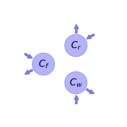
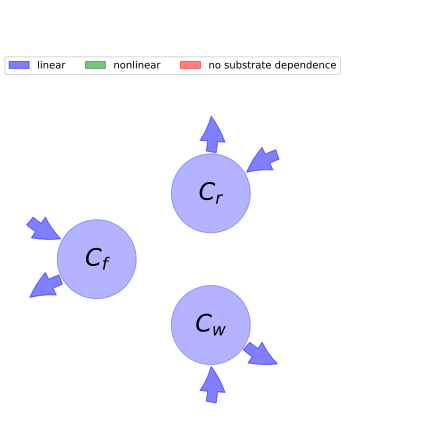

  
  
# General Overview  
  

 

This report is the result of the use of the python package bgc_md, as means to translate published models to a common language.  The underlying yaml file was created by Verónika Ceballos-Núñez (Orcid ID: 0000-0002-0046-1160) on 16/3/2016.  
  
  
  
## About the model  
  
The model depicted in this document considers carbon allocation with a process based approach. It was originally described by @Murty2000EcologicalModelling.  
  
  
  
### Space Scale  
  
global
  
  
Name|Description|Unit  
:-----|:-----|:-----  
$C_{f}$|Foliar carbon mass|$kgC\cdot m^{-2}$  
$C_{r}$|Root carbon|$kgC\cdot m^{-2}$  
$C_{w}$|Carbon in woody tissue|$kgC\cdot m^{-2}$  
  Table: state_variables  
  
  
Name|Description|Expression|Unit  
:-----|:-----|:-----:|:-----  
$C_{sw}$|Sapwood carbon content|$C_{sw}=1.11\cdot C_{w}^{0.77}$|$kgC\cdot m^{-2}$  
$N_{f}$|Nitrogen content of foliage|-|$kgN\cdot m^{-2}$  
$N_{r}$|Nitrogen content of fine roots|-|-  
$n_{f}$|Foliar N:C ratio|-|-  
$n_{crit}$|Foliar N:C ratio below which production is N-limited|-|-  
$T_{a}$|Mean air temperature|-|-  
$Q_{10}$|\text{None}|-|-  
$Q_{010}$|\text{None}|-|-  
  Table: additional_variables  
  
  
Name|Description|Expression|Unit  
:-----|:-----|:-----:|:-----  
$I_{0}$|Incident PAR|-|$GJ\cdot m^{-2}$  
$\sigma$|Leaf area per unit carbon|-|$m^{2}\cdot kgC^{-1}$  
$k$|Light extinction coefficient|-|$kgC\cdot m^{-2}$  
$APAR$|Absorbed photosynthetically active radiation|$APAR=I_{0}\cdot\left(1 - e^{- C_{f}\cdot k\cdot\sigma}\right)$|-  
$E_{nf}$|Function that represents the dependence of NPP on foliar N:C ratio (n_f)|$E_{nf}=\begin{cases}\frac{\left(n_{crit} + 0.017\right)\cdot\left(1.84\cdot n_{f} - 0.01\right)}{\left(1.84\cdot n_{crit} - 0.01\right)\cdot\left(n_{f} + 0.017\right)} &\text{for}\: n_{crit} > n_{f}\\1 &\text{for}\: n_{crit} < n_{f}\end{cases}$|-  
$\epsilon_{young}$|Maximum gross PAR utilization efficiency of young stands|-|$gC\cdot MJ^{-1}$  
$\epsilon_{old}$|Maximum gross PAR utilization efficiency of old stands|-|$gC\cdot MJ^{-1}$  
$\epsilon_{0}$|Maximum gross PAR utilization efficiency|$\epsilon_{0}=\begin{cases}\epsilon_{young} &\text{for}\: t{\leq} t_{1}\\\begin{cases}\epsilon_{young} -\frac{\left(-\epsilon_{old} +\epsilon_{young}\right)\cdot\left(t - t_{1}\right)}{- t_{1} + t_{2}} &\text{for}\: t > t_{1}\\\begin{cases}\epsilon_{young} -\frac{\left(-\epsilon_{old} +\epsilon_{young}\right)\cdot\left(t - t_{1}\right)}{- t_{1} + t_{2}} &\text{for}\: t < t_{2}\\\epsilon_{old} &\text{otherwise}\end{cases} &\text{otherwise}\end{cases} &\text{otherwise}\end{cases}$|$gC\cdot MJ^{-1}$  
$GPP$|Gross primary production|$GPP=APAR\cdot E_{nf}\cdot\epsilon_{0}$|-  
$NPP$|Annual net primary production|$NPP=GPP - R_{c} - R_{m}$|$kgC\cdot m^{-2}\cdot year^{-1}$  
  Table: photosynthetic_parameters  
  
  
Name|Description|Expression|Unit  
:-----|:-----|:-----:|:-----  
$R_{c}$|Total construction respiration|-|-  
$R_{0}$|Respiration rate per unit nitrogen content corresponding to a temperature of 0°C|-|$kgC\cdot kgN^{-1}\cdot year^{-1}$  
$R_{mf}$|Annual maintenance respiration rate of foliage (dark period only)|$R_{mf}=0.5\cdot N_{f}\cdot Q_{10}^{\frac{T_{a}}{10}}\cdot R_{0}$|-  
$R_{mr}$|Annual maintenance respiration rate of fine roots (dark period only)|$R_{mr}=N_{r}\cdot Q_{10}^{\frac{T_{a}}{10}}\cdot R_{0}$|-  
$R_{msw}$|Annual maintenance respiration rate of sapwood (dark period only)|$R_{msw}=0.00876\cdot C_{sw}\cdot Q_{010}^{\frac{T_{a}}{10}}$|-  
$R_{m}$|Total maintenance respiration|$R_{m}=R_{mf} + R_{mr} + R_{msw}$|-  
  Table: respiration_parameters  
  
  
Name|Description|Expression  
:-----|:-----|:-----:  
$a_{f}$|Allocation fraction to foliar biomass|-  
$a_{r}$|Allocation fraction to roots biomass|-  
$a_{w}$|Allocation fraction to wood (in stem, branches and large structurl roots) biomass|$a_{w}=- a_{f} - a_{r} + 1$  
  Table: allocation_coefficients  
  
  
Name|Description|Unit  
:-----|:-----|:-----  
$\gamma_{f}$|Foliage senescence rate|$yr^{-1}$  
$\gamma_{r}$|Roots senescence rate|$yr^{-1}$  
$\gamma_{w}$|Wood senescence rate|$yr^{-1}$  
  Table: cycling_rates  
  
  
Name|Description|Expression  
:-----|:-----|:-----:  
$x$|vector of states for vegetation|$x=\left[\begin{matrix}C_{f}\\C_{r}\\C_{w}\end{matrix}\right]$  
$u$|scalar function of photosynthetic inputs|$u=NPP$  
$b$|vector of partitioning coefficients of photosynthetically fixed carbon|$b=\left[\begin{matrix}a_{f}\\a_{r}\\a_{w}\end{matrix}\right]$  
$A$|matrix of senescence (cycling) rates|$A=\left[\begin{matrix}-\gamma_{f} & 0 & 0\\0 & -\gamma_{r} & 0\\0 & 0 & -\gamma_{w}\end{matrix}\right]$  
$f_{v}$|the righthandside of the ode|$f_{v}=u b + A x$  
  Table: components  
  
  
## Pool model representation  
  

 

 **Figure 1:** *Pool model representation* 

  
  
#### Input fluxes  
  
$C_{f}: a_{f}\cdot\left(- 0.0097236\cdot C_{w}^{0.77}\cdot Q_{010}^{\frac{T_{a}}{10}} + I_{0}\cdot\left(1 - e^{- C_{f}\cdot k\cdot\sigma}\right)\cdot\left(\begin{cases}\epsilon_{young} &\text{for}\: t{\leq} t_{1}\\\begin{cases}\epsilon_{young} -\frac{\left(-\epsilon_{old} +\epsilon_{young}\right)\cdot\left(t - t_{1}\right)}{- t_{1} + t_{2}} &\text{for}\: t > t_{1}\\\begin{cases}\epsilon_{young} -\frac{\left(-\epsilon_{old} +\epsilon_{young}\right)\cdot\left(t - t_{1}\right)}{- t_{1} + t_{2}} &\text{for}\: t < t_{2}\\\epsilon_{old} &\text{otherwise}\end{cases} &\text{otherwise}\end{cases} &\text{otherwise}\end{cases}\right)\cdot\left(\begin{cases}\frac{\left(n_{crit} + 0.017\right)\cdot\left(1.84\cdot n_{f} - 0.01\right)}{\left(1.84\cdot n_{crit} - 0.01\right)\cdot\left(n_{f} + 0.017\right)} &\text{for}\: n_{crit} > n_{f}\\1 &\text{for}\: n_{crit} < n_{f}\end{cases}\right) - 0.5\cdot N_{f}\cdot Q_{10}^{\frac{T_{a}}{10}}\cdot R_{0} - N_{r}\cdot Q_{10}^{\frac{T_{a}}{10}}\cdot R_{0} - R_{c}\right)$  
$C_{r}: a_{r}\cdot\left(- 0.0097236\cdot C_{w}^{0.77}\cdot Q_{010}^{\frac{T_{a}}{10}} + I_{0}\cdot\left(1 - e^{- C_{f}\cdot k\cdot\sigma}\right)\cdot\left(\begin{cases}\epsilon_{young} &\text{for}\: t{\leq} t_{1}\\\begin{cases}\epsilon_{young} -\frac{\left(-\epsilon_{old} +\epsilon_{young}\right)\cdot\left(t - t_{1}\right)}{- t_{1} + t_{2}} &\text{for}\: t > t_{1}\\\begin{cases}\epsilon_{young} -\frac{\left(-\epsilon_{old} +\epsilon_{young}\right)\cdot\left(t - t_{1}\right)}{- t_{1} + t_{2}} &\text{for}\: t < t_{2}\\\epsilon_{old} &\text{otherwise}\end{cases} &\text{otherwise}\end{cases} &\text{otherwise}\end{cases}\right)\cdot\left(\begin{cases}\frac{\left(n_{crit} + 0.017\right)\cdot\left(1.84\cdot n_{f} - 0.01\right)}{\left(1.84\cdot n_{crit} - 0.01\right)\cdot\left(n_{f} + 0.017\right)} &\text{for}\: n_{crit} > n_{f}\\1 &\text{for}\: n_{crit} < n_{f}\end{cases}\right) - 0.5\cdot N_{f}\cdot Q_{10}^{\frac{T_{a}}{10}}\cdot R_{0} - N_{r}\cdot Q_{10}^{\frac{T_{a}}{10}}\cdot R_{0} - R_{c}\right)$  
$C_{w}: \left(- a_{f} - a_{r} + 1\right)\cdot\left(- 0.0097236\cdot C_{w}^{0.77}\cdot Q_{010}^{\frac{T_{a}}{10}} + I_{0}\cdot\left(1 - e^{- C_{f}\cdot k\cdot\sigma}\right)\cdot\left(\begin{cases}\epsilon_{young} &\text{for}\: t{\leq} t_{1}\\\begin{cases}\epsilon_{young} -\frac{\left(-\epsilon_{old} +\epsilon_{young}\right)\cdot\left(t - t_{1}\right)}{- t_{1} + t_{2}} &\text{for}\: t > t_{1}\\\begin{cases}\epsilon_{young} -\frac{\left(-\epsilon_{old} +\epsilon_{young}\right)\cdot\left(t - t_{1}\right)}{- t_{1} + t_{2}} &\text{for}\: t < t_{2}\\\epsilon_{old} &\text{otherwise}\end{cases} &\text{otherwise}\end{cases} &\text{otherwise}\end{cases}\right)\cdot\left(\begin{cases}\frac{\left(n_{crit} + 0.017\right)\cdot\left(1.84\cdot n_{f} - 0.01\right)}{\left(1.84\cdot n_{crit} - 0.01\right)\cdot\left(n_{f} + 0.017\right)} &\text{for}\: n_{crit} > n_{f}\\1 &\text{for}\: n_{crit} < n_{f}\end{cases}\right) - 0.5\cdot N_{f}\cdot Q_{10}^{\frac{T_{a}}{10}}\cdot R_{0} - N_{r}\cdot Q_{10}^{\frac{T_{a}}{10}}\cdot R_{0} - R_{c}\right)$  

  
  
#### Output fluxes  
  
$C_{f}: C_{f}\cdot\gamma_{f}$  
$C_{r}: C_{r}\cdot\gamma_{r}$  
$C_{w}: C_{w}\cdot\gamma_{w}$  
  
  
## References  
  
