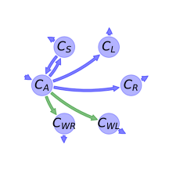
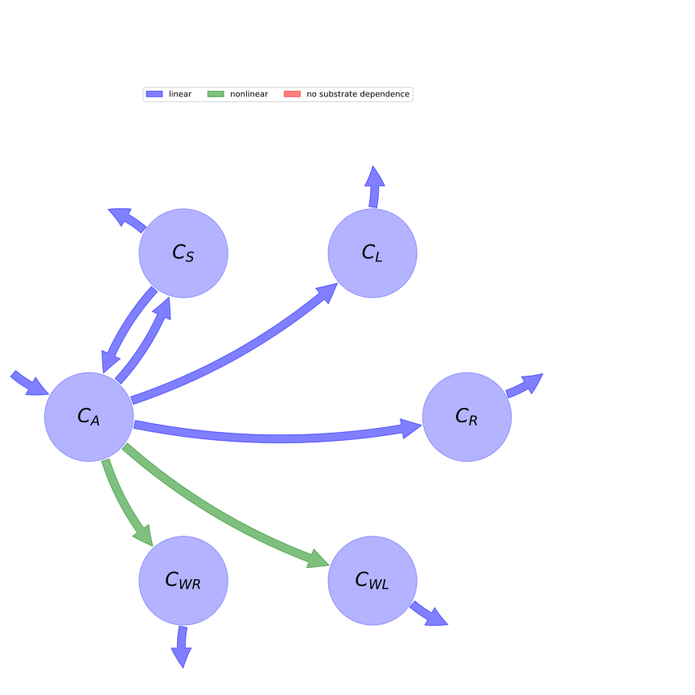

  
  
# General Overview  
  

 

This report is the result of the use of the python package bgc_md, as means to translate published models to a common language.  The underlying yaml file was created by Verónika Ceballos-Núñez (Orcid ID: 0000-0002-0046-1160) on \mathrm{None}.  
  
  
  
## About the model  
  
The model depicted in this document considers carbon allocation with a process based approach. It was originally described by @Pavlick2013Biogeosciences.  
  
  
  
### Space Scale  
  
global
  
  
Name|Description|Unit  
:-----|:-----|:-----  
$C_{A}$|Carbon in stored assimilates|$gC\cdot m^{-2}$  
$C_{L}$|Carbon in leaves|$gC\cdot m^{-2}$  
$C_{R}$|Carbon in fine roots|$gC\cdot m^{-2}$  
$C_{WL}$|Carbon in aboveground wood (branches and stems)|$gC\cdot m^{-2}$  
$C_{WR}$|Carbon in belowground wood (coarse roots)|$gC\cdot m^{-2}$  
$C_{S}$|Carbon in seeds (reproductive tisses)|$gC\cdot m^{-2}$  
  Table: state_variables  
The model section in the yaml file has no subsection: additional_variables.  
  
Name|Description|Expression  
:-----|:-----|:-----:  
$x$|vector of states for vegetation|$x=\left[\begin{matrix}C_{A}\\C_{S}\\C_{L}\\C_{R}\\C_{WL}\\C_{WR}\end{matrix}\right]$  
$u$|scalar function of photosynthetic inputs|$u=NPP$  
$b$|vector of partitioning coefficients of photosynthetically fixed carbon|$b=\left[\begin{matrix}1\\0\\0\\0\\0\\0\end{matrix}\right]$  
$A$|matrix of cycling rates|$A=\left[\begin{matrix}- A_{L}\cdot\left(- C_{RES L} + 1\right) - A_{R}\cdot\left(- C_{RES R} + 1\right) - A_{S}\cdot\left(- C_{RES S} + 1\right) - A_{WL}\cdot\left(- C_{RES WL} + 1\right) - A_{WR}\cdot\left(- C_{RES WR} + 1\right) &\frac{f_{GERM}\cdot\gamma_{GERM}}{\max\left(k_{GERM}, p\right)} & 0 & 0 & 0 & 0\\A_{S}\cdot\left(- C_{RES S} + 1\right) & -\frac{f_{GERM}\cdot\gamma_{GERM}}{\max\left(k_{GERM}, p\right)} -\frac{1}{\tau_{S}} & 0 & 0 & 0 & 0\\A_{L}\cdot\left(- C_{RES L} + 1\right) & 0 & -\frac{1}{\tau_{L}} & 0 & 0 & 0\\A_{R}\cdot\left(- C_{RES R} + 1\right) & 0 & 0 & -\frac{1}{\tau_{R}} & 0 & 0\\A_{WL}\cdot\left(- C_{RES WL} + 1\right) & 0 & 0 & 0 & -\frac{1}{\tau_{WL}} & 0\\A_{WR}\cdot\left(- C_{RES WR} + 1\right) & 0 & 0 & 0 & 0 & -\frac{1}{\tau_{WR}}\end{matrix}\right]$  
$f_{v}$|the righthandside of the ode|$f_{v}=u b + A x$  
  Table: components  
  
  
## Pool model representation  
  

 

 **Figure 1:** *Pool model representation* 

  
  
#### Input fluxes  
  
$C_{A}: GPP - RES_{a}$  

  
  
#### Output fluxes  
  
$C_{S}: \frac{C_{S}}{\tau_{S}}$  
$C_{L}: \frac{C_{L}}{\tau_{L}}$  
$C_{R}: \frac{C_{R}}{\tau_{R}}$  
$C_{WL}: \frac{C_{WL}}{\tau_{WL}}$  
$C_{WR}: \frac{C_{WR}}{\tau_{WR}}$  

  
  
#### Internal fluxes  
  
$C_{A} \rightarrow C_{S}: -\frac{C_{A}\cdot f_{SEED}\cdot t_{5}\cdot\left(C_{RES S} - 1\right)}{t_{5} + t_{6} + t_{7} + t_{8}}$  
$C_{A} \rightarrow C_{L}: \frac{C_{A}\cdot f_{GROW}\cdot t_{6}\cdot\left(C_{RES L} - 1\right)\cdot\left(t_{9} - 1\right)}{t_{5} + t_{6} + t_{7} + t_{8}}$  
$C_{A} \rightarrow C_{R}: \frac{C_{A}\cdot f_{GROW}\cdot t_{7}\cdot\left(C_{RES R} - 1\right)\cdot\left(t_{10} - 1\right)}{t_{5} + t_{6} + t_{7} + t_{8}}$  
$C_{A} \rightarrow C_{WL}: -\frac{C_{A}\cdot f_{GROW}\cdot t_{6}\cdot t_{9}\cdot e^{- 0.5\cdot C_{L}\cdot SLA}}{t_{5} + t_{6} + t_{7} + t_{8}}\cdot\left(C_{RES WL} - 1\right)\cdot\left(e^{0.5\cdot C_{L}\cdot SLA} - 1\right)$  
$C_{A} \rightarrow C_{WR}: -\frac{C_{A}\cdot f_{GROW}\cdot t_{10}\cdot t_{7}\cdot e^{- 0.5\cdot C_{L}\cdot SLA}}{t_{5} + t_{6} + t_{7} + t_{8}}\cdot\left(C_{RES WR} - 1\right)\cdot\left(e^{0.5\cdot C_{L}\cdot SLA} - 1\right)$  
$C_{S} \rightarrow C_{A}: \frac{C_{S}\cdot f_{GERM}}{\max\left(k_{GERM}, p\right)}\cdot 10^{\frac{4}{t_{4}^{4}}}$  
  
  
## References  
  
