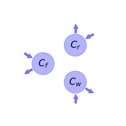
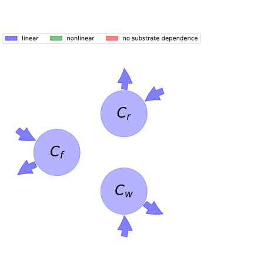

  
  
# General Overview  
  

 

This report is the result of the use of the python package bgc_md, as means to translate published models to a common language.  The underlying yaml file was created by Verónika Ceballos-Núñez (Orcid ID: 0000-0002-0046-1160) on 17/7/2015.  
  
  
  
## About the model  
  
The model depicted in this document considers carbon allocation with a process based approach. It was originally described by @Potter1993GlobalBiogeochemicalCycles.  
  
  
  
### Space Scale  
  
global
  
  
### Available parameter values  
  
  
  
Abbreviation|Source  
:-----|:-----  
Original dataset of the publication|@Potter1993GlobalBiogeochemicalCycles  
Tundra|@Potter1999BioScience  
High-latitude forest|@Potter1999BioScience  
Boreal coniferous forest|@Potter1999BioScience  
Temperate grassland|@Potter1999BioScience  
Mixed coniferous forest|@Potter1999BioScience  
Temperate deciduous forest|@Potter1999BioScience  
Desert and bare ground|@Potter1999BioScience  
Semi-arid shrubland|@Potter1999BioScience  
Savanna and woody grassland|@Potter1999BioScience  
Tropical evergreen rain forest|@Potter1999BioScience  
  Table:  Information on given parameter sets  
  
  
Name|Description  
:-----|:-----  
$C_{f}$|Carbon in foliage  
$C_{r}$|Carbon in roots  
$C_{w}$|Carbon in woody tissue  
  Table: state_variables  
  
  
Name|Description|Expression|Unit  
:-----|:-----|:-----:|:-----  
$t$|time step|-|$year$  
$SOL$|Total solar radiation (SOL(x,t))|-|-  
$FPAR$|Fraction of incoming PAR intercerpted by green vegetation (FPAR(x,t))|-|-  
$IPAR$|Intercepted photosynthetically active radiation(IPAR(x,t)). The factor of 0.5 accounts for the fact that approx. half of SOL is in PAR waveband (0.4-0.7 $\mu$m)|$IPAR=0.5\cdot FPAR\cdot SOL$|-  
$\epsilon$|PAR use efficiency ($\epsilon(x,t)$). Function that depends on effects of temperature and water stress|-|-  
$NPP$|New production of plant biomass (NPP(x,t)) at a grid cell ($x$) in month $t$|$NPP=IPAR\cdot\epsilon$|-  
  Table: photosynthetic_parameters  
  
  
Name|Description  
:-----|:-----  
$\alpha_{f}$|Proportional allocation constant of available carbon allocated to foliage  
$\alpha_{r}$|Proportional allocation constant of available carbon allocated to roots  
$\alpha_{w}$|Proportional allocation constant of available carbon allocated to wood  
  Table: allocation_coefficients  
  
  
Name|Description|Unit  
:-----|:-----|:-----  
$\tau_{f}$|Residence time of carbon in foliage|$years$  
$\tau_{r}$|Residence time of carbon in roots|$years$  
$\tau_{w}$|Residence time of carbon in wood|$years$  
  Table: cycling_rates  
  
  
Name|Description|Expression  
:-----|:-----|:-----:  
$x$|vector of states for vegetation|$x=\left[\begin{matrix}C_{f}\\C_{r}\\C_{w}\end{matrix}\right]$  
$u$|scalar function of photosynthetic inputs|$u=NPP$  
$b$|vector of partitioning coefficients of photosynthetically fixed carbon|$b=\left[\begin{matrix}\alpha_{f}\\\alpha_{r}\\\alpha_{w}\end{matrix}\right]$  
$A$|matrix of turnover (cycling) rates|$A=\left[\begin{matrix}-\tau_{f} & 0 & 0\\0 & -\tau_{r} & 0\\0 & 0 & -\tau_{w}\end{matrix}\right]$  
$f_{v}$|the righthandside of the ode|$f_{v}=u b + A x$  
  Table: components  
  
  
## Pool model representation  
  

 

 **Figure 1:** *Pool model representation* 

  
  
#### Input fluxes  
  
$C_{f}: 0.5\cdot FPAR\cdot SOL\cdot\alpha_{f}\cdot\epsilon$  
$C_{r}: 0.5\cdot FPAR\cdot SOL\cdot\alpha_{r}\cdot\epsilon$  
$C_{w}: 0.5\cdot FPAR\cdot SOL\cdot\alpha_{w}\cdot\epsilon$  

  
  
#### Output fluxes  
  
$C_{f}: C_{f}\cdot\tau_{f}$  
$C_{r}: C_{r}\cdot\tau_{r}$  
$C_{w}: C_{w}\cdot\tau_{w}$  
  
  
## Steady state formulas  
  
$C_f = \frac{0.5\cdot FPAR\cdot SOL\cdot\alpha_{f}\cdot\epsilon}{\tau_{f}}$  
  
  
  
$C_r = \frac{0.5\cdot FPAR\cdot SOL\cdot\alpha_{r}\cdot\epsilon}{\tau_{r}}$  
  
  
  
$C_w = \frac{0.5\cdot FPAR\cdot SOL\cdot\alpha_{w}\cdot\epsilon}{\tau_{w}}$  
  
  
  
  
  
## References  
  
