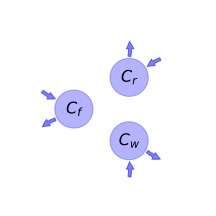
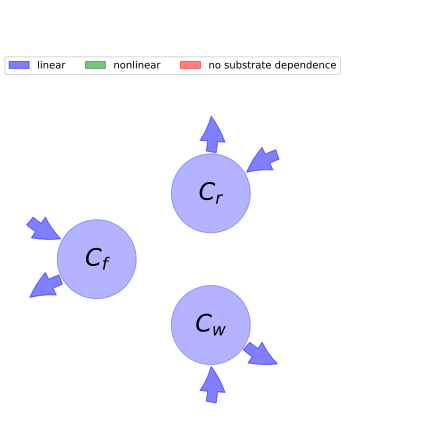

  
  
# General Overview  
  

 

This report is the result of the use of the python package bgc_md, as means to translate published models to a common language.  The underlying yaml file was created by Verónika Ceballos-Núñez (Orcid ID: 0000-0002-0046-1160) on 17/7/2015.  
  
  
  
## About the model  
  
The model depicted in this document considers carbon allocation with a process based approach. It was originally described by @Running1988EcologicalModelling.  
  
  
  
### Space Scale  
  
forest
  
  
Name|Description  
:-----|:-----  
$C_{f}$|Carbon in foliage  
$C_{r}$|Carbon in roots  
$C_{w}$|Carbon in woody tissue  
  Table: state_variables  
The model section in the yaml file has no subsection: additional_variables.  
  
Name|Description|Expression  
:-----|:-----|:-----:  
$x$|vector of states for vegetation|$x=\left[\begin{matrix}C_{f}\\C_{r}\\C_{w}\end{matrix}\right]$  
$u$|scalar function of photosynthetic inputs|-  
$b$|vector of partitioning coefficients of photosynthetically fixed carbon|$b=\left[\begin{matrix}\eta_{f}\\\eta_{r}\\\eta_{w}\end{matrix}\right]$  
$A$|matrix of turnover (cycling) rates|$A=\left[\begin{matrix}-\gamma_{f} & 0 & 0\\0 & -\gamma_{r} & 0\\0 & 0 & -\gamma_{w}\end{matrix}\right]$  
$f_{v}$|the righthandside of the ode|$f_{v}=u b + A x$  
  Table: components  
  
  
## Pool model representation  
  

 

 **Figure 1:** *Pool model representation* 

  
  
#### Input fluxes  
  
$C_{f}: \eta_{f}\cdot u$  
$C_{r}: \eta_{r}\cdot u$  
$C_{w}: \eta_{w}\cdot u$  

  
  
#### Output fluxes  
  
$C_{f}: C_{f}\cdot\gamma_{f}$  
$C_{r}: C_{r}\cdot\gamma_{r}$  
$C_{w}: C_{w}\cdot\gamma_{w}$  
  
  
## Steady state formulas  
  
$C_f = \frac{\eta_{f}\cdot u}{\gamma_{f}}$  
  
  
  
$C_r = \frac{\eta_{r}\cdot u}{\gamma_{r}}$  
  
  
  
$C_w = \frac{\eta_{w}\cdot u}{\gamma_{w}}$  
  
  
  
  
  
## References  
  
