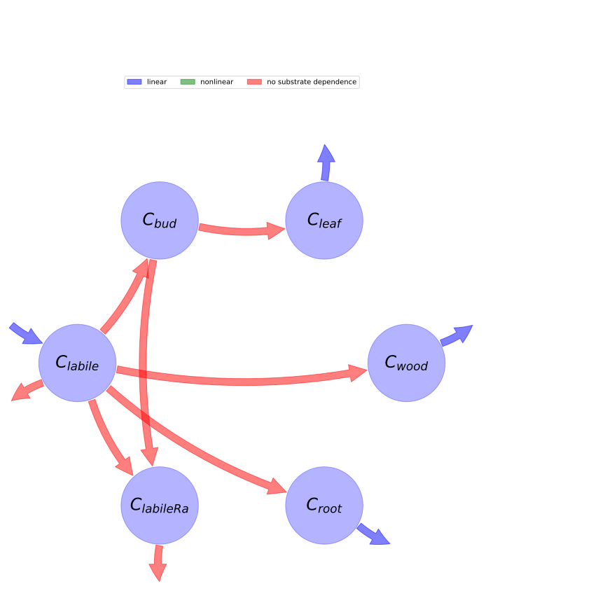

  
  
# General Overview  
  

 

This report is the result of the use of the python package bgc_md, as means to translate published models to a common language.  The underlying yaml file was created by Verónika Ceballos-Núñez (Orcid ID: 0000-0002-0046-1160) on 29/3/2016.  
  
  
  
## About the model  
  
The model depicted in this document considers carbon allocation with a process based approach. It was originally described by @Thomas2014GeoscientificModelDevelopment.  
  
  
  
### Space Scale  
  
global
  
  
Name|Description  
:-----|:-----  
$C_{leaf}$|Carbon in foliage  
$C_{wood}$|Carbon in wood  
$C_{root}$|Carbon in roots  
$C_{labile}$|Labile carbon  
$C_{bud}$|Bud carbon  
$C_{labileRa}$|Maintenance respiration pool  
  Table: state_variables  
  
  
Name|Description|Expression|Unit  
:-----|:-----|:-----:|:-----  
$GPP$|Photosynthesis; based on ACM model (see article for description)|-|$gC\cdot day^{-1}$  
  Table: photosynthetic_parameters  
  
  
Name|Description|Unit  
:-----|:-----|:-----  
$Ra_{growth}$|Growth respiration that occurs when tissue is allocated; a constant fraction of carbon allocated to tissue|$gC\cdot m^{-2}\cdot day^{-1}$  
$Ra_{excess}$|Respiration that occurs when labile C exceeds a maximum labile C store; used for N fixation|$gC\cdot m^{-2}\cdot day^{-1}$  
$Ra_{main}$|Respiration of living tissues; a function of N content and temperature|$gC\cdot m^{-2}\cdot day^{-1}$  
  Table: respiration_fluxes  
  
  
Name|Description|Unit  
:-----|:-----|:-----  
$a_{budC2leaf}$|Allocation from bud C pool to leaf C|$gC\cdot m^{-2}\cdot day^{-1}$  
$a_{woodC}$|Allocation from labile C to wood C|$gC\cdot m^{-2}\cdot day^{-1}$  
$a_{rootC}$|Allocation from labile C to root C|$gC\cdot m^{-2}\cdot day^{-1}$  
$a_{budC2Ramain}$|Allocation of bud C pool to maintenance respiration pool when maintain respiration pool reaches zero; represents forgoing future leaf C to prevent carbon starvation.|$gC\cdot m^{-2}\cdot day^{-1}$  
$a_{budC}$|Allocation of labile C to bud C; a fraction of the potential maximum leaf C|$gC\cdot m^{-2}\cdot day^{-1}$  
$a_{Ramain}$|Allocation of labile C to future maintenance respiration; helps prevent carbon starvation during periods of negative NPP|$gC\cdot m^{-2}\cdot day^{-1}$  
$a_{labileRamain}$|Allocation of labile C to respiration of living tissues|$gC\cdot m^{-2}\cdot day^{-1}$  
  Table: allocation_fluxes  
  
  
Name|Description|Expression|Unit  
:-----|:-----|:-----:|:-----  
$\tau_{leaf}$|Turnover of leaf (C and N)|-|$day^{-1}$  
$\tau_{wood}$|Turnover of wood (C and N)|-|$day^{-1}$  
$\tau_{root}$|Turnover of root (C and N)|-|$day^{-1}$  
$t_{leafC}$|Turnover of leaf C to litter C; constant over year in humid tropics; seasonal otherwise|$t_{leafC}=C_{leaf}\cdot\tau_{leaf}$|$gC\cdot m^{-2}\cdot day^{-1}$  
$t_{woodC}$|Turnover of wood C to CWDC pool; occurs throughout year|$t_{woodC}=C_{wood}\cdot\tau_{wood}$|$gC\cdot m^{-2}\cdot day^{-1}$  
$t_{rootC}$|Turnover of root C to litter C; occurs throughout year|$t_{rootC}=C_{root}\cdot\tau_{root}$|$gC\cdot m^{-2}\cdot day^{-1}$  
  Table: turnover_fluxes  
  
  
Name|Description|Expression  
:-----|:-----|:-----:  
$x$|vector of states (C$_{i}$) for vegetation|$x=\left[\begin{matrix}C_{labile}\\C_{bud}\\C_{leaf}\\C_{wood}\\C_{root}\\C_{labileRa}\end{matrix}\right]$  
$u$|scalar function of photosynthetic inputs|$u=GPP$  
$b$|vector of partitioning coefficients of photosynthetically fixed carbon|$b=\left[\begin{matrix}1\\0\\0\\0\\0\\0\end{matrix}\right]$  
$A_{x}$|matrix of cycling rates|$A_{x}=\left[\begin{matrix}\frac{- Ra_{excess} - Ra_{growth} - a_{budC} - a_{labileRamain} - a_{rootC} - a_{woodC}}{C_{labile}} & 0 & 0 & 0 & 0 & 0\\\frac{a_{budC}}{C_{labile}} &\frac{- a_{budC2Ramain} - a_{budC2leaf}}{C_{bud}} & 0 & 0 & 0 & 0\\0 &\frac{a_{budC2leaf}}{C_{bud}} & -\tau_{leaf} & 0 & 0 & 0\\\frac{a_{woodC}}{C_{labile}} & 0 & 0 & -\tau_{wood} & 0 & 0\\\frac{a_{rootC}}{C_{labile}} & 0 & 0 & 0 & -\tau_{root} & 0\\\frac{a_{labileRamain}}{C_{labile}} &\frac{a_{budC2Ramain}}{C_{bud}} & 0 & 0 & 0 & -\frac{Ra_{main}}{C_{labileRa}}\end{matrix}\right]$  
$f_{v}$|the righthandside of the ode|$f_{v}=u b + A_{x} x$  
  Table: components  
  
  
## Pool model representation  
  

 

 **Figure 1:** *Pool model representation* 

  
  
#### Input fluxes  
  
$C_{labile}: GPP$  

  
  
#### Output fluxes  
  
$C_{labile}: Ra_{excess} + Ra_{growth}$  
$C_{leaf}: C_{leaf}\cdot\tau_{leaf}$  
$C_{wood}: C_{wood}\cdot\tau_{wood}$  
$C_{root}: C_{root}\cdot\tau_{root}$  
$C_{labileRa}: Ra_{main}$  

  
  
#### Internal fluxes  
  
$C_{labile} \rightarrow C_{bud}: a_{budC}$  
$C_{labile} \rightarrow C_{wood}: a_{woodC}$  
$C_{labile} \rightarrow C_{root}: a_{rootC}$  
$C_{labile} \rightarrow C_{labileRa}: a_{labileRamain}$  
$C_{bud} \rightarrow C_{leaf}: a_{budC2leaf}$  
$C_{bud} \rightarrow C_{labileRa}: a_{budC2Ramain}$  
  
  
## Steady state formulas  
  
$C_labile = C_{labile}$  
  
  
  
$C_bud = C_{bud}$  
  
  
  
$C_leaf = \frac{a_{budC2leaf}}{\tau_{leaf}}$  
  
  
  
$C_wood = \frac{a_{woodC}}{\tau_{wood}}$  
  
  
  
$C_root = \frac{a_{rootC}}{\tau_{root}}$  
  
  
  
$C_labileRa = C_{labileRa}$  
  
  
  
  
  
## References  
  
