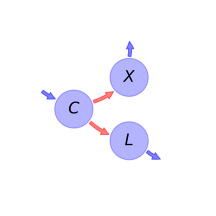

  
  
# General Overview  
  

 

This report is the result of the use of the python package bgc_md, as means to translate published models to a common language.  The underlying yaml file was created by Verónika Ceballos-Núñez (Orcid ID: 0000-0002-0046-1160) on \text{None}.  
  
  
  
## About the model  
  
The model depicted in this document considers carbon allocation with a process based approach. It was originally described by @Trugman2018EcologyLetters.  
  
  
  
Name|Description|Unit  
:-----|:-----|:-----  
$C$|Non-structural carbon (NSC), starch|$kgC\cdot m^{-2}$  
$X$|Xylem biomass|$kgC\cdot m^{-2}$  
$L$|Leaf and fine roots biomass which are linearly related through a constant|$kgC\cdot m^{-2}$  
  Table: state_variables  
The model section in the yaml file has no subsection: additional_variables.  
  
Name|Description|Expression  
:-----|:-----|:-----:  
$x$|vector of states for vegetation|$x=\left[\begin{matrix}C\\X\\L\end{matrix}\right]$  
$u$|scalar function of photosynthetic inputs|$u=A_{n}$  
$\beta$|vector of partitioning coefficients of photosynthetically fixed carbon|$\beta=\left[\begin{matrix}1\\0\\0\end{matrix}\right]$  
$B$|matrix of cycling rates|$B=\left[\begin{matrix}-\frac{W}{C} & 0 & 0\\\frac{U\cdot W}{C} & - m_{X} & 0\\\frac{W\cdot\left(1 - U\right)}{C} & 0 & - m_{L}\end{matrix}\right]$  
$f_{v}$|the righthandside of the ode|$f_{v}=u\beta + B x$  
  Table: components  
  
  
## Pool model representation  
  

 

 **Figure 1:** *Pool model representation* 

  
  
#### Input fluxes  
  
$C: A_{n}$  

  
  
#### Output fluxes  
  
$X: X\cdot m_{X}$  
$L: L\cdot m_{L}$  

  
  
#### Internal fluxes  
  
$C \rightarrow X: \frac{X\cdot\left(C\cdot W_{max} - L_{opt}\cdot\left(C + C_{i}\cdot k_{c}\right)\cdot\left(m_{L} + m_{X}\right)\right)}{\left(C + C_{i}\cdot k_{c}\right)\cdot\left(L_{opt} + X\right)}$  
$C \rightarrow L: \frac{C\cdot W_{max}\cdot\left(L_{opt} + X\right) - X\cdot\left(C\cdot W_{max} - L_{opt}\cdot\left(C + C_{i}\cdot k_{c}\right)\cdot\left(m_{L} + m_{X}\right)\right)}{\left(C + C_{i}\cdot k_{c}\right)\cdot\left(L_{opt} + X\right)}$  
  
  
## Steady state formulas  
  
$C = -\frac{A_{n}\cdot C_{i}\cdot k_{c}}{A_{n} - W_{max}}$  
  
  
  
$X = 0$  
  
  
  
$L = \frac{A_{n}}{m_{L}}$  
  
  
  
$C = -\frac{A_{n}\cdot C_{i}\cdot k_{c}}{A_{n} - W_{max}}$  
  
  
  
$X = \frac{A_{n} - L_{opt}\cdot m_{L} - 2\cdot L_{opt}\cdot m_{X}}{m_{X}}$  
  
  
  
$L = \frac{L_{opt}\cdot\left(m_{L} + 2\cdot m_{X}\right)}{m_{L}}$  
  
  
  
  
  
## References  
  
