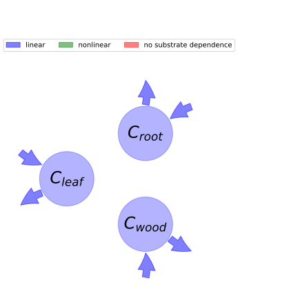

  
  
# General Overview  
  

 

This report is the result of the use of the python package bgc_md, as means to translate published models to a common language.  The underlying yaml file was created by Verónika Ceballos-Núñez (Orcid ID: 0000-0002-0046-1160) on 14/3/2016.  
  
  
  
## About the model  
  
The model depicted in this document considers carbon allocation with a process based approach. It was originally described by @Wang2010Biogeosciences.  
  
  
  
### Space Scale  
  
global
  
  
### Available parameter values  
  
  
  
Abbreviation|Source  
:-----|:-----  
Evergreen needle leaf forest|@Wang2010Biogeosciences  
Evergreen broadleaf forest|@Wang2010Biogeosciences  
Deciduous needle leaf forest|@Wang2010Biogeosciences  
Deciduous broadleaf forest|@Wang2010Biogeosciences  
Mixed forest|@Wang2010Biogeosciences  
Shrub land (open and close shrubland)|@Wang2010Biogeosciences  
Woddy savannah|@Wang2010Biogeosciences  
Savannah|@Wang2010Biogeosciences  
Grassland|@Wang2010Biogeosciences  
Crop land (cropland mosaic was aggregated into this term)|@Wang2010Biogeosciences  
Barren or sparse vegetation|@Wang2010Biogeosciences  
  Table:  Information on given parameter sets  
  
  
Name|Description  
:-----|:-----  
$C_{leaf}$|Plant (carbon) pool Leaf  
$C_{root}$|Plant (carbon) pool Root  
$C_{wood}$|Plant (carbon) pool Wood  
  Table: state_variables  
  
  
Name|Description|Expression|Unit  
:-----|:-----|:-----:|:-----  
$\Delta_{t}$|Time step of model integration|-|$d$  
$N_{min}$|Amount of mineral N in soil|-|$gN\cdot m^{-2}$  
$P_{lab}$|Amount of labile P in soil|-|$gP\cdot m^{-2}$  
$F_{nupmin}$|Minimum amount of N uptake required to sustain a given NPP|-|-  
$F_{pupmin}$|Minimum amount of P uptake required to sustain a given NPP|-|-  
$x_{nup}$|Nitrogen uptake limitation on NPP|$x_{nup}=\min\left(1,\frac{N_{min}}{\Delta_{t}\cdot F_{nupmin}}\right)$|-  
$x_{pup}$|Phosphorus uptake limitation on NPP|$x_{pup}=\min\left(1,\frac{P_{lab}}{\Delta_{t}\cdot F_{pupmin}}\right)$|-  
$x_{npup}$|Nutrient uptake limiting factor|$x_{npup}=\min\left(x_{nup}, x_{pup}\right)$|-  
$n_{leaf}$|N:C ratio of leaf biomass|-|$gN/gC$  
$p_{leaf}$|P:C ratio of leaf biomass|-|$gP/gC$  
$k_{n}$|Empirical constant|-|$gN\cdot (gC)^{-1}$  
$k_{p}$|Empirical constant|-|$gP\cdot (gC)^{-1}$  
$x_{nleaf}$|\text{None}|$x_{nleaf}=\frac{n_{leaf}}{k_{n} + n_{leaf}}$|-  
$x_{pleaf}$|\text{None}|$x_{pleaf}=\frac{p_{leaf}}{k_{p} + p_{leaf}}$|-  
$x_{npleaf}$|Nutrient concentration limiting factor|$x_{npleaf}=\min\left(x_{nleaf}, x_{pleaf}\right)$|-  
$F_{cmax}$|Nutrient unlimited NPP|-|$gC\cdot m^{-2}\cdot d^{-1}$  
$F_{c}$|Net Primary Productivity (flux)|$F_{c}=F_{cmax}\cdot x_{npleaf}\cdot x_{npup}$|$gC\cdot m^{-2}\cdot d^{-1}$  
  Table: photosynthetic_parameters  
  
  
Name|Description  
:-----|:-----  
$a_{leaf}$|Fraction of NPP allocated to plant pool Leaf  
$a_{root}$|Fraction of NPP allocated to plant pool Root  
$a_{wood}$|Fraction of NPP allocated to plant pool Wood  
  Table: allocation_coefficients  
  
  
Name|Description|Expression|Unit  
:-----|:-----|:-----:|:-----  
$x$|vector of states for vegetation|$x=\left[\begin{matrix}C_{leaf}\\C_{root}\\C_{wood}\end{matrix}\right]$|-  
$u$|scalar function of photosynthetic inputs|$u=F_{c}$|-  
$b$|vector of partitioning coefficients of photosynthetically fixed carbon|$b=\left[\begin{matrix}a_{leaf}\\a_{root}\\a_{wood}\end{matrix}\right]$|-  
$A$|matrix of turnover (cycling) rates|$A=\left[\begin{matrix}-\mu_{leaf} & 0 & 0\\0 & -\mu_{root} & 0\\0 & 0 & -\mu_{wood}\end{matrix}\right]$|-  
$f_{v}$|the righthandside of the ode|$f_{v}=u b + A x$|$gC\cdot m^{-2}\cdot d^{-1}$  
  Table: components  
  
  
## Pool model representation  
  

 

 **Figure 1:** *Pool model representation* 

  
  
#### Input fluxes  
  
$C_{leaf}: F_{cmax}\cdot a_{leaf}\cdot\min\left(\frac{n_{leaf}}{k_{n} + n_{leaf}},\frac{p_{leaf}}{k_{p} + p_{leaf}}\right)\cdot\min\left(1,\frac{N_{min}}{\Delta_{t}\cdot F_{nupmin}},\frac{P_{lab}}{\Delta_{t}\cdot F_{pupmin}}\right)$  
$C_{root}: F_{cmax}\cdot a_{root}\cdot\min\left(\frac{n_{leaf}}{k_{n} + n_{leaf}},\frac{p_{leaf}}{k_{p} + p_{leaf}}\right)\cdot\min\left(1,\frac{N_{min}}{\Delta_{t}\cdot F_{nupmin}},\frac{P_{lab}}{\Delta_{t}\cdot F_{pupmin}}\right)$  
$C_{wood}: F_{cmax}\cdot a_{wood}\cdot\min\left(\frac{n_{leaf}}{k_{n} + n_{leaf}},\frac{p_{leaf}}{k_{p} + p_{leaf}}\right)\cdot\min\left(1,\frac{N_{min}}{\Delta_{t}\cdot F_{nupmin}},\frac{P_{lab}}{\Delta_{t}\cdot F_{pupmin}}\right)$  

  
  
#### Output fluxes  
  
$C_{leaf}: C_{leaf}\cdot\mu_{leaf}$  
$C_{root}: C_{root}\cdot\mu_{root}$  
$C_{wood}: C_{wood}\cdot\mu_{wood}$  
  
  
## Steady state formulas  
  
$C_leaf = \frac{F_{cmax}\cdot a_{leaf}\cdot\min\left(\frac{n_{leaf}}{k_{n} + n_{leaf}},\frac{p_{leaf}}{k_{p} + p_{leaf}}\right)\cdot\min\left(1,\frac{N_{min}}{\Delta_{t}\cdot F_{nupmin}},\frac{P_{lab}}{\Delta_{t}\cdot F_{pupmin}}\right)}{\mu_{leaf}}$  
  
  
  
$C_root = \frac{F_{cmax}\cdot a_{root}\cdot\min\left(\frac{n_{leaf}}{k_{n} + n_{leaf}},\frac{p_{leaf}}{k_{p} + p_{leaf}}\right)\cdot\min\left(1,\frac{N_{min}}{\Delta_{t}\cdot F_{nupmin}},\frac{P_{lab}}{\Delta_{t}\cdot F_{pupmin}}\right)}{\mu_{root}}$  
  
  
  
$C_wood = \frac{F_{cmax}\cdot a_{wood}\cdot\min\left(\frac{n_{leaf}}{k_{n} + n_{leaf}},\frac{p_{leaf}}{k_{p} + p_{leaf}}\right)\cdot\min\left(1,\frac{N_{min}}{\Delta_{t}\cdot F_{nupmin}},\frac{P_{lab}}{\Delta_{t}\cdot F_{pupmin}}\right)}{\mu_{wood}}$  
  
  
  
  
  
## References  
  
