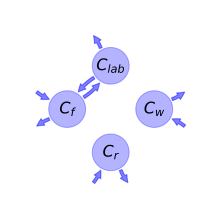
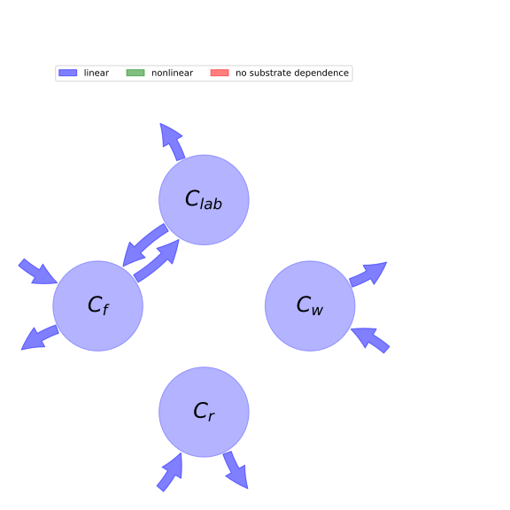

  
  
# General Overview  
  

 

This report is the result of the use of the python package bgc_md, as means to translate published models to a common language.  The underlying yaml file was created by Verónika Ceballos-Núñez (Orcid ID: 0000-0002-0046-1160) on 16/9/2016.  
  
  
  
## About the model  
  
The model depicted in this document considers carbon allocation with a process based approach. It was originally described by @Williams2005GlobalChangeBiology.  
  
  
  
### Keywords  
  
Deciduous forest, Phenology
  
  
### Principles  
  
All C fixed during a day is either released -autotrophic respiration (Ra)- or allocated to tissue pools (C_f, C_w, C_r), R_a is not directly temperature sensitive, Phenology -> Timing of leaf out controlled by simple growing degree day model, and leaf-fall by a min. temperature threshold., Maximum amount of C that can be allocated to leaves is limited by the parameter C_fmax, All C losses are via mineralization (no dissolved losses)
  
  
### Space Scale  
  
deciduous forest
  
  
### Available parameter values  
  
  
  
Abbreviation|Description|Source  
:-----|:-----|:-----  
param_vals|NPP value was given per year. p~14~, p~15~ and p~16~ values not given in publication|@Williams2005GlobalChangeBiology  
  Table:  Information on given parameter sets  
  
  
### Available initial values  
  
  
  
Abbreviation|Description|Source  
:-----|:-----|:-----  
init_vals|C_lab values not provided in publication|@Williams2005GlobalChangeBiology  
  Table:  Information on given sets of initial values  
  
  
Name|Description|Unit  
:-----|:-----|:-----  
$C_{f}$|Foliar C mass|$gC\cdot m^{-2}$  
$C_{lab}$|Labile C mass|$gC\cdot m^{-2}$  
$C_{w}$|Wood C mass|$gC\cdot m^{-2}$  
$C_{r}$|Fine root C mass|$gC\cdot m^{-2}$  
  Table: state_variables  
  
  
Name|Description|Unit  
:-----|:-----|:-----  
$NPP$|\text{None}|$gC\cdot m^{-2}\cdot day^{-1}$  
  Table: photosynthetic_parameters  
  
  
Name|Description|Unit  
:-----|:-----|:-----  
$p_{2}$|Fraction of GPP respired|-  
$p_{16}$|Fraction of labile transfers respired|$day^{-1}$  
  Table: respiration_parameters  
  
  
Name|Description  
:-----|:-----  
$p_{3}$|Fraction of NPP partitioned to foliage  
$p_{4}$|Fraction of NPP partitioned to roots  
  Table: partitioning_coefficients  
  
  
Name|Description|Unit  
:-----|:-----|:-----  
$p_{5}$|Turnover rate of foliage|$day^{-1}$  
$p_{6}$|Turnover rate of wood|$day^{-1}$  
$p_{7}$|Turnover rate of roots|$day^{-1}$  
$p_{14}$|Fraction of leaf loss transferred to litter|-  
$p_{15}$|Turnover rate of labile carbon|$day^{-1}$  
  Table: cycling_rates  
  
  
Name|Description|Expression|Unit  
:-----|:-----|:-----:|:-----  
$t$|time|-|$day$  
$p_{10}$|Parameter in exponential term of temperature dependent rate parameter|-|-  
$mint$|Dayly minimum temperature|-|-  
$maxt$|Dayly maximum temperature|-|-  
$T_{rate}$|Temperature sensitive rate parameter|$T_{rate}=0.5\cdot e^{0.5\cdot p_{10}\cdot\left(maxt + mint\right)}$|-  
$multtl$|Turnover of labile C (0 = off, 1 = On)|-|-  
$multtf$|Turnover of foliage C (0 = off, 1 = On)|-|-  
  Table: phenology_parameters  
  
  
Name|Description|Expression  
:-----|:-----|:-----:  
$x$|vector of states of vegetation|$x=\left[\begin{matrix}C_{f}\\C_{lab}\\C_{w}\\C_{r}\end{matrix}\right]$  
$u$|scalar function of photosynthetic inputs|$u=NPP$  
$b$|vector of partitioning coefficients of photosynthetically fixed carbon|$b=\left[\begin{matrix}multtl\cdot p_{3}\\0\\1 - p_{4}\\p_{4}\end{matrix}\right]$  
$A$|matrix of cycling rates|$A=\left[\begin{matrix}- T_{rate}\cdot multtf\cdot p_{16}\cdot p_{5}\cdot\left(1 - p_{14}\right) - T_{rate}\cdot multtf\cdot p_{5}\cdot\left(1 - p_{14}\right)\cdot\left(1 - p_{16}\right) - multtf\cdot p_{14}\cdot p_{5} & T_{rate}\cdot multtl\cdot p_{15}\cdot\left(1 - p_{16}\right) & 0 & 0\\T_{rate}\cdot multtf\cdot p_{5}\cdot\left(1 - p_{14}\right)\cdot\left(1 - p_{16}\right) & - T_{rate}\cdot multtl\cdot p_{15}\cdot p_{16} - T_{rate}\cdot multtl\cdot p_{15}\cdot\left(1 - p_{16}\right) & 0 & 0\\0 & 0 & - p_{6} & 0\\0 & 0 & 0 & - p_{7}\end{matrix}\right]$  
$f_{v}$|the right hand side of the ode|$f_{v}=u b + A x$  
  Table: components  
  
  
## Pool model representation  
  

 

 **Figure 1:** *Pool model representation* 

  
  
#### Input fluxes  
  
$C_{f}: NPP\cdot multtl\cdot p_{3}$  
$C_{w}: NPP\cdot\left(1 - p_{4}\right)$  
$C_{r}: NPP\cdot p_{4}$  

  
  
#### Output fluxes  
  
$C_{f}: C_{f}\cdot multtf\cdot p_{5}\cdot\left(p_{14} - 0.5\cdot p_{16}\cdot\left(p_{14} - 1\right)\cdot e^{0.5\cdot p_{10}\cdot\left(maxt + mint\right)}\right)$  
$C_{lab}: 0.5\cdot C_{lab}\cdot multtl\cdot p_{15}\cdot p_{16}\cdot e^{0.5\cdot p_{10}\cdot\left(maxt + mint\right)}$  
$C_{w}: C_{w}\cdot p_{6}$  
$C_{r}: C_{r}\cdot p_{7}$  

  
  
#### Internal fluxes  
  
$C_{f} \rightarrow C_{lab}: 0.5\cdot C_{f}\cdot multtf\cdot p_{5}\cdot\left(p_{14} - 1\right)\cdot\left(p_{16} - 1\right)\cdot e^{0.5\cdot p_{10}\cdot\left(maxt + mint\right)}$  
$C_{lab} \rightarrow C_{f}: - 0.5\cdot C_{lab}\cdot multtl\cdot p_{15}\cdot\left(p_{16} - 1\right)\cdot e^{0.5\cdot p_{10}\cdot\left(maxt + mint\right)}$  
  
  
## Steady state formulas  
  
$C_f = \frac{2.0\cdot NPP\cdot multtl\cdot p_{3}\cdot e^{0.5\cdot p_{10}\cdot\left(maxt + mint\right)}}{multtf\cdot p_{5}\cdot\left(\left(p_{16} - 1.0\right)\cdot\left(p_{14}\cdot p_{16} - p_{14} - p_{16} + 1.0\right)\cdot e^{p_{10}\cdot\left(maxt + mint\right)} +\left(- p_{14}\cdot e^{0.5\cdot p_{10}\cdot\left(maxt + mint\right)} + 2.0\cdot p_{14} + e^{0.5\cdot p_{10}\cdot\left(maxt + mint\right)}\right)\cdot e^{0.5\cdot p_{10}\cdot\left(maxt + mint\right)}\right)}$  
  
  
  
$C_lab = \frac{2.0\cdot NPP\cdot p_{3}\cdot\left(p_{14}\cdot p_{16} - p_{14} - p_{16} + 1.0\right)\cdot e^{0.5\cdot p_{10}\cdot\left(maxt + mint\right)}}{p_{15}\cdot\left(\left(p_{16} - 1.0\right)\cdot\left(p_{14}\cdot p_{16} - p_{14} - p_{16} + 1.0\right)\cdot e^{p_{10}\cdot\left(maxt + mint\right)} +\left(- p_{14}\cdot e^{0.5\cdot p_{10}\cdot\left(maxt + mint\right)} + 2.0\cdot p_{14} + e^{0.5\cdot p_{10}\cdot\left(maxt + mint\right)}\right)\cdot e^{0.5\cdot p_{10}\cdot\left(maxt + mint\right)}\right)}$  
  
  
  
$C_w = -\frac{NPP\cdot\left(p_{4} - 1.0\right)}{p_{6}}$  
  
  
  
$C_r = \frac{NPP\cdot p_{4}}{p_{7}}$  
  
  
  
  
  
## References  
  
