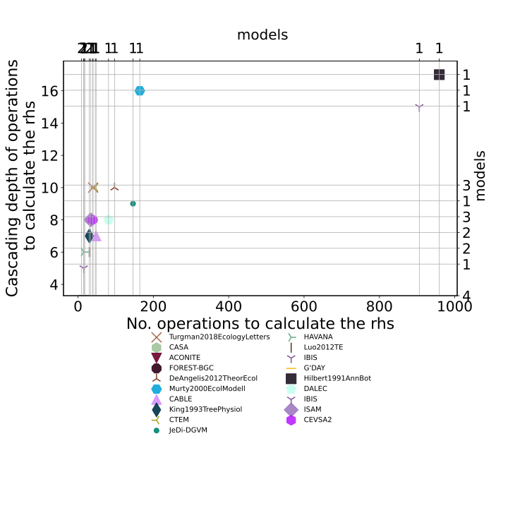

  
  
Structure|Model|# State variables|Diagonal matrix?|Partitioning scheme|Claimed to favour a limiting compartment?|Source  
:-----|:-----:|:-----:|:-----:|:-----:|:-----:|:-----:  
$f_{v}=u\cdot \beta+B\cdot x$|[Turgman2018EcologyLetters](Turgman2018EcologyLetters/index.html)|$3$|False|dynamic|yes|@Trugman2018EcologyLetters  
$f_{v}=u\cdot b+A\cdot x$|[CASA](Potter1993GlobalBiogeochmemCy/index.html)|$3$|True|fixed|no|@Potter1993GlobalBiogeochemicalCycles  
$f_{v}=u\cdot b+A_{x}\cdot x$|[ACONITE](Thomas2014GeosciModelDev/index.html)|$6$|False|fixed|no|@Thomas2014GeoscientificModelDevelopment  
$f_{v}=u\cdot b+A\cdot x$|[FOREST-BGC](Running1988EcolModel/index.html)|$3$|True|fixed|no|@Running1988EcologicalModelling  
$f_{v}=u\cdot b+A\cdot x$|[DeAngelis2012TheorEcol](DeAngelis2012TheorEcol/index.html)|$5$|True|fixed|yes|@DeAngelis2011TheoreticalEcology  
$f_{v}=u\cdot b+A\cdot x$|[Murty2000EcolModell](Murty2000EcolModell/index.html)|$3$|True|fixed|no|@Murty2000EcologicalModelling  
$f_{v}=u\cdot b+A\cdot x$|[CABLE](Wang2010Biogeosciences/index.html)|$3$|True|fixed|no|@Wang2010Biogeosciences  
$f_{v}=u\cdot b+A\cdot x$|[King1993TreePhysiol](King1993TreePhysiol/index.html)|$3$|True|fixed|yes|@King1993TreePhysiology  
$f_{v}=u+A\cdot x$|[CTEM](Arora2005GCB-1/index.html)|$3$|True|dynamic|yes|@Arora2005GlobalChangeBiology  
$f_{v}=u\cdot b+A\cdot x$|[JeDi-DGVM](Pavlick2013Biogeosciences/index.html)|$6$|False|dynamic|yes|@Pavlick2013Biogeosciences  
$f_{v}=u\cdot \beta+B\cdot x$|[HAVANA](Haverd2016Biogeosciences/index.html)|$3$|True|dynamic|yes|@Haverd2016Biogeosciences  
$f_{v}=u\cdot b+A\cdot x$|[Luo2012TE](Luo2012TE/index.html)|$3$|True|fixed|no|@Luo2012TE  
$f_{v}=u\cdot b+A\cdot x$|[IBIS](Castanho2013Biogeosciences/index.html)|$3$|True|dynamic|no|@Castanho2013Biogeosciences  
$f_{v}=u\cdot b+A\cdot x$|[G'DAY](Comins1993EA/index.html)|$3$|True|fixed|no|@Comins1993Ecological_Applications  
$f_{v}=u\cdot b+A_{x}\cdot x$|[Hilbert1991AnnBot](Hilbert1991AnnBot/index.html)|$5$|False|dynamic|yes|@Hilbert1991Annals_of_Botany  
$f_{v}=u\cdot b+A\cdot x$|[DALEC](Williams2005GCB/index.html)|$4$|False|dynamic|yes|@Williams2005GlobalChangeBiology  
$f_{v}=u\cdot b+A\cdot x$|[IBIS](Foley1996GBC/index.html)|$3$|True|fixed|yes|@Foley1996GlobalBiogeochemicalCycles  
$f_{v}=u+A\cdot x$|[ISAM](ElMasri2013AgricForMeteorol/index.html)|$3$|True|dynamic|yes|@Arora2005GlobalChangeBiology  
$f_{v}=u\cdot b+A\cdot x$|[CEVSA2](Gu2010EcologicalComplexity/index.html)|$3$|True|dynamic|yes|@Gu2010EcologicalComplexity  
  Table: Summary of the models in the database of Carbon Allocation in Vegetation models  
  

 

 **Figure 1:** *Histograms,  variables* 

 

 **Figure 2:** *No. variables & parameters* 

 

 **Figure 3:** *No. variables & operations* 

 

 **Figure 4:** *No. variables & cascading depth of operations* 

 

 **Figure 5:** *No. variables & cascading depth of operations* 

 

 **Figure 6:** *Type of carbon partitioning scheme among pools and No.  operations* 

 

 **Figure 7:** *Type of carbon partitioning scheme among pools and claim to have a dynamic partitionings* 

 

 **Figure 8:** *Number of state variables and C cycling among compartments* 

 

 **Figure 6:** *Dependency plots of compartment variables* 

  
  
# Bibliography  
  
