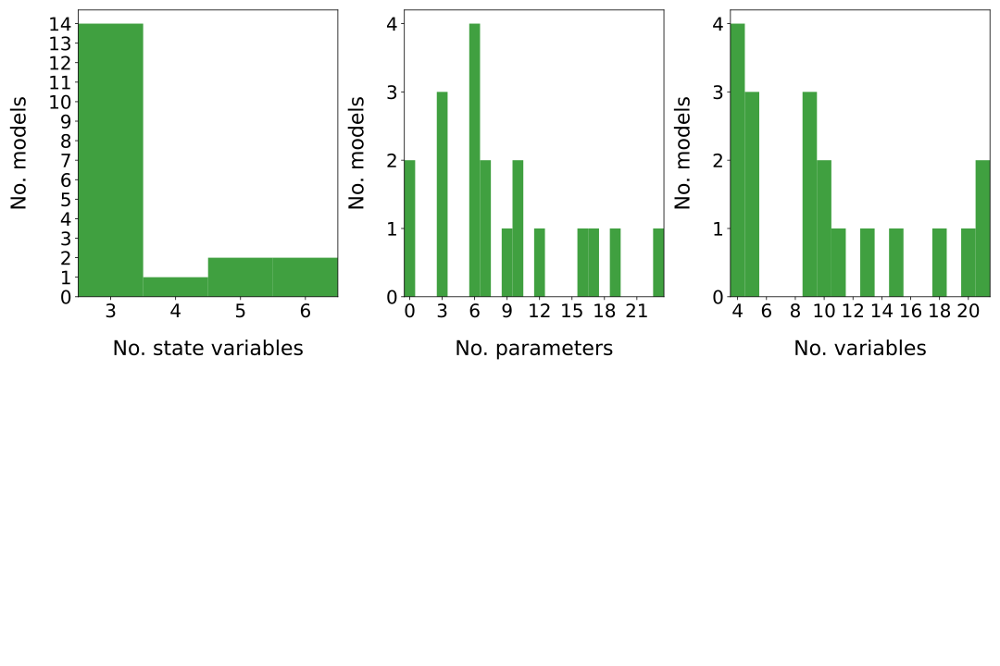
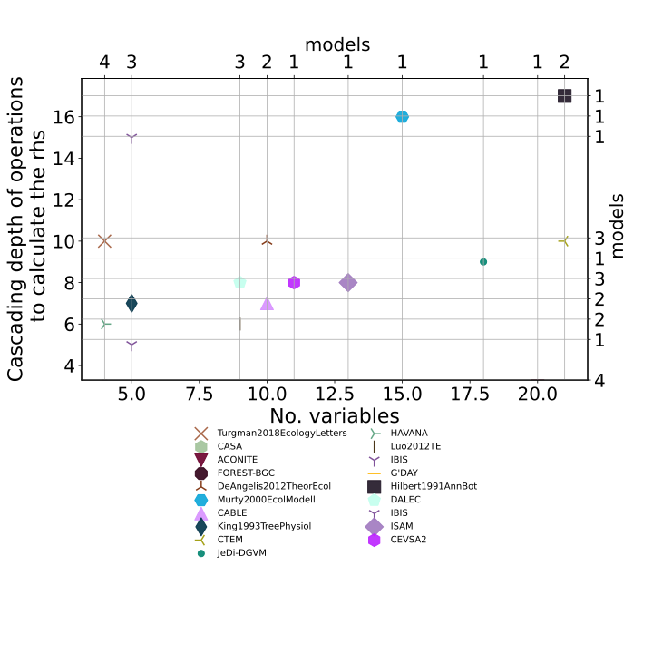
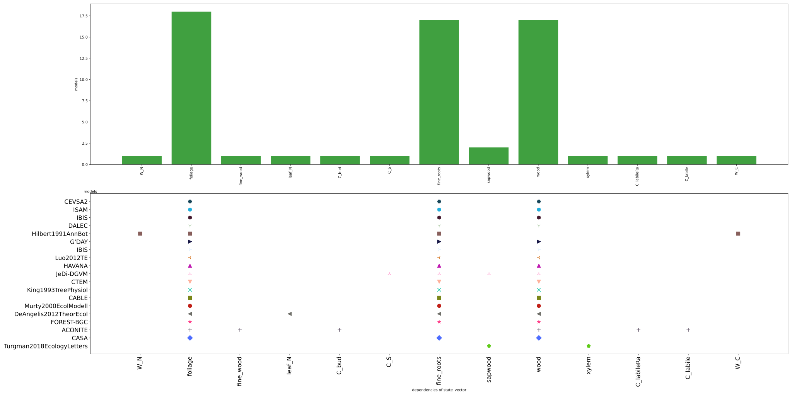

  
  
Model|# Variables|# Constants|Structure|Source  
:-----|:-----:|:-----:|:-----:|:-----:  
[Murty2000EcolModell](Murty2000EcolModell/index.html)|$15$|$12$|$f_{v}=u\cdot b+A\cdot x$|@Murty2000EcologicalModelling  
[CEVSA2](Gu2010EcologicalComplexity/index.html)|$11$|$7$|$f_{v}=u\cdot b+A\cdot x$|@Gu2010EcologicalComplexity  
[IBIS](Foley1996GBC/index.html)|$4$|$6$|$f_{v}=u\cdot b+A\cdot x$|@Foley1996GlobalBiogeochemicalCycles  
[CASA](Potter1993GlobalBiogeochmemCy/index.html)|$9$|$6$|$f_{v}=u\cdot b+A\cdot x$|@Potter1993GlobalBiogeochemicalCycles  
[CTEM](Arora2005GCB-1/index.html)|$21$|$23$|$f_{v}=u+A\cdot x$|@Arora2005GlobalChangeBiology  
[DALEC](Williams2005GCB/index.html)|$9$|$10$|$f_{v}=u\cdot b+A\cdot x$|@Williams2005GlobalChangeBiology  
[FOREST-BGC](Running1988EcolModel/index.html)|$4$|$6$|$f_{v}=u\cdot b+A\cdot x$|@Running1988EcologicalModelling  
[JeDi-DGVM](Pavlick2013Biogeosciences/index.html)|$18$|$10$|$f_{v}=u\cdot b+A\cdot x$|@Pavlick2013Biogeosciences  
[Luo2012TE](Luo2012TE/index.html)|$9$|$7$|$f_{v}=u\cdot b+A\cdot x$|@Luo2012TE  
[King1993TreePhysiol](King1993TreePhysiol/index.html)|$5$|$9$|$f_{v}=u\cdot b+A\cdot x$|@King1993TreePhysiology  
[ISAM](ElMasri2013AgricForMeteorol/index.html)|$13$|$3$|$f_{v}=u+A\cdot x$|@Arora2005GlobalChangeBiology  
[Hilbert1991AnnBot](Hilbert1991AnnBot/index.html)|$21$|$19$|$f_{v}=u\cdot b+A_{x}\cdot x$|@Hilbert1991Annals_of_Botany  
[ACONITE](Thomas2014GeosciModelDev/index.html)|$20$|$3$|$f_{v}=u\cdot b+A_{x}\cdot x$|@Thomas2014GeoscientificModelDevelopment  
[DeAngelis2012TheorEcol](DeAngelis2012TheorEcol/index.html)|$10$|$17$|$f_{v}=u\cdot b+A\cdot x$|@DeAngelis2011TheoreticalEcology  
[G'DAY](Comins1993EA/index.html)|$4$|$6$|$f_{v}=u\cdot b+A\cdot x$|@Comins1993Ecological_Applications  
[IBIS](Castanho2013Biogeosciences/index.html)|$5$|$3$|$f_{v}=u\cdot b+A\cdot x$|@Castanho2013Biogeosciences  
[CABLE](Wang2010Biogeosciences/index.html)|$10$|$16$|$f_{v}=u\cdot b+A\cdot x$|@Wang2010Biogeosciences  
  Table: Summary of the models in the database of Carbon Allocation in Vegetation models  
  

 

 **Figure 1:** *Histograms,  variables* 

 

 **Figure 2:** *No. variables & parameters* 

 

 **Figure 3:** *No. variables & operations* 

 

 **Figure 4:** *No. variables & cascading depth of operations* 

 

 **Figure 5:** *No. variables & cascading depth of operations* 

 

 **Figure 6:** *Type of carbon partitioning scheme among pools and No.  operations* 

 

 **Figure 7:** *Type of carbon partitioning scheme among pools and claim to have a dynamic partitionings* 

 

 **Figure 8:** *Number of state variables and C cycling among compartments* 

 

 **Figure 6:** *Dependency plots of compartment variables* 

  
  
# Bibliography  
  
