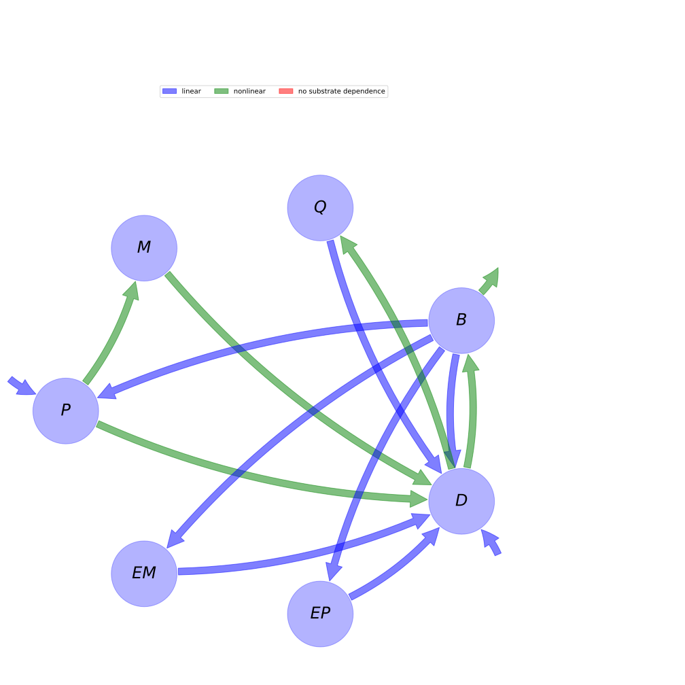

  
  
---
title: 'Report of the model: Microbial-Enzyme-Mediated Decomposition model (MEND), version: 1'
---
  
  
# General Overview  
  

 

This report is the result of the use of the python package bgc_md, as means to translate published models to a common language.  The underlying yaml file was created by Holger Metzler (Orcid ID: 0000-0002-8239-1601) on 21/03/2016.  
  
  
  
## About the model  
  
The model depicted in this document considers soil organic matter decomposition. It was originally described by @Wang2013EcologicalApplications.  
  
  
  
### Keywords  
  
differential equations, nonlinear, time invariant, Michaelis-Menten
  
  
### Principles  
  
mass balance, substrate dependence of decomposition, heterogeneity of speed of decay, internal transformations of organic matter, substrate interactions
  
  
Name|Description|Unit  
:-----|:-----|:-----  
$P$|particulate organic carbon pool|$mgC g^{-1}\text{ soil}$  
$M$|mineral associated organic carbon pool|$mgC g^{-1}\text{ soil}$  
$Q$|active layer of $M$ interacting with dissolved organic carbon through adsorption and desorption|$mgC g^{-1}\text{ soil}$  
$B$|microbial biomass pool|$mgC g^{-1}\text{ soil}$  
$D$|dissolved organic carbon pool|$mgC g^{-1}\text{ soil}$  
$EP$|enzymes for the decomposition of $P$|$mgC g^{-1}\text{ soil}$  
$EM$|enzymes for the decompsotion of $M$|$mgC g^{-1}\text{ soil}$  
  Table: state_variables  
  
  
Name|Description|Unit  
:-----|:-----|:-----  
$V_{P}$|maximum specific decomposition rate for $P$ by $EP$|$h^{-1}$  
$K_{P}$|half-saturation constant for decomposition of $P$|$mgC g^{-1}\text{ soil}$  
$V_{M}$|maximum specific decomposition rate for $M$ by $EM$|$h^{-1}$  
$K_{M}$|half-saturation constant for decomposition of $M$|$mgC g^{-1}\text{ soil}$  
$V_{D}$|maximum specific uptake rate of $D$ for growth of $B$|$h^{-1}$  
$K_{D}$|half-saturation constant for uptake of $D$ for growth of $B$|$mgC g^{-1}\text{ soil}$  
$m_{R}$|specific maintenance factor or rate|$h^{-1}$  
$E_{C}$|carbon use efficiency|-  
$Q_{max}$|maximum dissolved organic carbon sorption capacity|$mgC g^{-1}\text{ soil}$  
$K_{ads}$|specific adsorption rate|$h^{-1}$  
$K_{des}$|desorption rate|$h^{-1}$  
$r_{EP}$|turnover rate of $EP$|$h^{-1}$  
$r_{EM}$|turnover rate of $EM$|$h^{-1}$  
$g_{D}$|fraction of dead $B$ allocated to $D$|-  
$p_{EP}$|fraction of $m_{R}$ for production of $EP$|-  
$p_{EM}$|fraction of $m_{R}$ for production of $EM$|-  
$f_{D}$|fraction of decomposed $P$ allocated to $D$|-  
  Table: parameters  
  
  
Name|Description|Expression|Unit  
:-----|:-----|:-----:|:-----  
$F_{E}$|enzyme production rate|$F_{E}=m_{R}$|$h^{-1}$  
$F_{R}$|microbial respiration rate|$F_{R}=\frac{D}{D + K_{D}}\cdot\left(-1 +\frac{1}{E_{C}}\right)\cdot\left(V_{D} + m_{R}\right)$|$h^{-1}$  
$F_{U}$|dissolved organic matter uptakte rate|$F_{U}=\frac{B\cdot\left(V_{D} + m_{R}\right)}{E_{C}\cdot\left(D + K_{D}\right)}$|$h^{-1}$  
$F_{A}$|adsorption rate of dissolved organic matter|$F_{A}=K_{ads}\cdot\left(-\frac{Q}{Q_{max}} + 1\right)$|$h^{-1}$  
  Table: additional_variables  
  
  
Name|Description|Expression  
:-----|:-----|:-----:  
$C$|carbon content|$C=\left[\begin{matrix}P\\M\\Q\\B\\D\\EP\\EM\end{matrix}\right]$  
$I$|input vector|$I=\left[\begin{matrix}I_{P}\\0\\0\\0\\I_{D}\\0\\0\end{matrix}\right]$  
$T$|transition operator|$T=\left[\begin{matrix}-1 & 0 & 0 &\frac{F_{E}}{F_{E} + F_{R}}\cdot\left(- g_{D} + 1\right)\cdot\left(- p_{EM} - p_{EP} + 1\right) & 0 & 0 & 0\\- f_{D} + 1 & -1 & 0 & 0 & 0 & 0 & 0\\0 & 0 & -1 & 0 &\frac{F_{A}}{F_{A} + F_{U}} & 0 & 0\\0 & 0 & 0 & -1 &\frac{F_{U}}{F_{A} + F_{U}} & 0 & 0\\f_{D} & 1 & 1 &\frac{F_{E}\cdot g_{D}}{F_{E} + F_{R}}\cdot\left(- p_{EM} - p_{EP} + 1\right) & -1 & 1 & 1\\0 & 0 & 0 &\frac{F_{E}\cdot p_{EP}}{F_{E} + F_{R}} & 0 & -1 & 0\\0 & 0 & 0 &\frac{F_{E}\cdot p_{EM}}{F_{E} + F_{R}} & 0 & 0 & -1\end{matrix}\right]$  
$N$|decomposition operator|$N=\left[\begin{matrix}\frac{EP\cdot V_{P}}{K_{P} + P} & 0 & 0 & 0 & 0 & 0 & 0\\0 &\frac{EM\cdot V_{M}}{K_{M} + M} & 0 & 0 & 0 & 0 & 0\\0 & 0 &\frac{K_{des}}{Q_{max}} & 0 & 0 & 0 & 0\\0 & 0 & 0 & F_{E} + F_{R} & 0 & 0 & 0\\0 & 0 & 0 & 0 & F_{A} + F_{U} & 0 & 0\\0 & 0 & 0 & 0 & 0 & r_{EP} & 0\\0 & 0 & 0 & 0 & 0 & 0 & r_{EM}\end{matrix}\right]$  
$f_{s}$|the right hand side of the ode|$f_{s}=T N C + I$  
  Table: components  
  
  
## Pool model representation  
  

 

 **Figure 1:** *Pool model representation* 

  
  
#### Input fluxes  
  
$P: I_{P}$  
$D: I_{D}$  

  
  
#### Output fluxes  
  
$B: -\frac{B\cdot D}{E_{C}\cdot\left(D + K_{D}\right)}\cdot\left(E_{C}\cdot V_{D} + E_{C}\cdot m_{R} - V_{D} - m_{R}\right)$  

  
  
#### Internal fluxes  
  
$P \rightarrow M: -\frac{EP\cdot P\cdot V_{P}}{K_{P} + P}\cdot\left(f_{D} - 1\right)$  
$P \rightarrow D: \frac{EP\cdot P\cdot V_{P}}{K_{P} + P}\cdot f_{D}$  
$M \rightarrow D: \frac{EM\cdot M\cdot V_{M}}{K_{M} + M}$  
$Q \rightarrow D: \frac{K_{des}}{Q_{max}}\cdot Q$  
$B \rightarrow P: B\cdot m_{R}\cdot\left(g_{D} - 1\right)\cdot\left(p_{EM} + p_{EP} - 1\right)$  
$B \rightarrow D: B\cdot g_{D}\cdot m_{R}\cdot\left(- p_{EM} - p_{EP} + 1\right)$  
$B \rightarrow EP: B\cdot m_{R}\cdot p_{EP}$  
$B \rightarrow EM: B\cdot m_{R}\cdot p_{EM}$  
$D \rightarrow Q: -\frac{D}{Q_{max}}\cdot K_{ads}\cdot\left(Q - Q_{max}\right)$  
$D \rightarrow B: \frac{B\cdot D\cdot\left(V_{D} + m_{R}\right)}{E_{C}\cdot\left(D + K_{D}\right)}$  
$EP \rightarrow D: EP\cdot r_{EP}$  
$EM \rightarrow D: EM\cdot r_{EM}$  
  
  
  
  
## Model simulations  
  
  
  
  
  
## Phaseplane plots  
  
  
  
  
  
## Fluxes  
  
  
  
  
  
## Mean ages  
  
To compute the moments we need a start_age distribution.  This distribution can be chosen arbitrarily by the user or contributor of the yaml file and should in this case be defined in the model run data.  If the model run data do not contain age distributions, we can compute some distributions for special situations  
  
### Zero age for the whole initial mass  
  
We assume that the contents of all pools (as described by the start values of a model run combination are zero  
  
### Steady state start age distribution   
  
In the general non autonomous case The model can be frozen at a time t_0. The resulting model is in general autonomous but nonlinear and might have fixed points. If fixedpoints can be found we can compute the age distribution that would have developed if the system had stayed in this equilibrium for infinite time. Note that any startvalues given in the model run data section will not influence this start distribution since it will use the equilibrium values if such can be found.  
  
  
  
## Age Density Evolution  
  

    To compute the moments we need a start_age distribution.  
    This distribution can be chosen arbitrarily by the user.
    At the moment the yaml files do not contain startdistributions.
    The package CompartmentalSystems has a module "start_age_densities"  which contains functions to compute some distributions for special situations.
    In this template we use only the simplest ones.  
  
### Zero age for the whole initial mass  
  
We assume that the contents of all pools (as described by the start values of a model run combination are zero  
  
## References  
  
