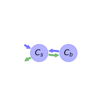

  
  
---
title: 'Report of the model: Two-pool microbial, version: 1'
---
  
  
# General Overview  
  

 

This report presents a general overview of the model Two-pool microbial , which is part of the Biogeochemistry Model Database BGC-MD.  The underlying yaml file entry that contains all the information of the model was created by Holger Metzler (Orcid ID: 0000-0002-8239-1601) on 18/01/2018. The entry was processed by the python package bgc-md to produce symbolic output.  
  
The model was originally described by @Wang2014BG.  
  
  
  
# Model description  
  
  
  
## State variables  
  
  
  
Name|Description|Unit  
:-----|:-----|:-----  
$C_{s}$|soil organic matter|$g C m^{-2}$  
$C_{b}$|microbial biomass|$g C m^{-2}$  
  Table: state_variables  
  
  
## Components of the compartmental system  
  
  
  
Name|Description|Expression  
:-----|:-----|:-----:  
$C$|carbon content|$C=\left[\begin{matrix}C_{s}\\C_{b}\end{matrix}\right]$  
$I$|input vector|$I=\left[\begin{matrix}F_{NPP}\\0\end{matrix}\right]$  
$A$|decomposition operator|$A=\left[\begin{matrix}-\lambda &\mu_{b}\\\epsilon\cdot\lambda & -\mu_{b}\end{matrix}\right]$  
$f_{s}$|the right hand side of the ode|$f_{s}=A C + I$  
  Table: components  
  
  
## Pool model representation  
  

 

 **Figure 1:** *Pool model representation* 

  
  
#### Input fluxes  
  
$C_{s}: F_{NPP}$  

  
  
#### Output fluxes  
  
$C_{s}: -\frac{C_{b}\cdot C_{s}\cdot V_{s}}{C_{s} + K_{s}}\cdot\left(\epsilon - 1\right)$  

  
  
#### Internal fluxes  
  
$C_{s} \rightarrow C_{b}: \frac{C_{b}\cdot C_{s}\cdot V_{s}}{C_{s} + K_{s}}\cdot\epsilon$  
$C_{b} \rightarrow C_{s}: C_{b}\cdot\mu_{b}$  
  
  
## Steady state formulas  
  
$C_s = \frac{K_{s}\cdot\mu_{b}}{V_{s}\cdot\epsilon -\mu_{b}}$  
  
  
  
$C_b = -\frac{F_{NPP}\cdot\epsilon}{\mu_{b}\cdot\left(\epsilon - 1\right)}$  
  
  
  
  
  
# References  
  
