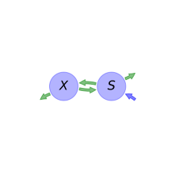
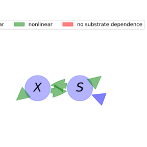

  
  
---
title: 'Report of the model: BACWAVE, version: 1'
---
  
  
# General Overview  
  

 

This report presents a general overview of the model BACWAVE , which is part of the Biogeochemistry Model Database BGC-MD.  The underlying yaml file entry that contains all the information of the model was created by Holger Metzler (Orcid ID: 0000-0002-8239-1601) on 15/03/2016. The entry was processed by the python package bgc-md to produce symbolic output.  
  
The model was originally described by @Zelenev2000MicrobialEcology.  
  
  
  
# Model description  
  
  
  
## State variables  
  
  
  
Name|Description|Unit  
:-----|:-----|:-----  
$X$|microbial biomass pool|$\mu gC cm^{-3}$  
$S$|substrate pool|$\mu gC cm^{-3}$  
  Table: state_variables  
  
  
## Components of the compartmental system  
  
  
  
Name|Description|Expression  
:-----|:-----|:-----:  
$C$|carbon content|$C=\left[\begin{matrix}X\\S\end{matrix}\right]$  
$I$|input vector|$I=\left[\begin{matrix}0\\BGF + Exu\end{matrix}\right]$  
$T$|transition operator|$T=\left[\begin{matrix}-1 & Y\\K_{r} & -1\end{matrix}\right]$  
$N$|decomposition operator|$N=\left[\begin{matrix}\frac{D_{max}\cdot K_{d}}{K_{d} +\frac{S}{\theta}} & 0\\0 &\frac{X\cdot\mu_{max}}{Y\cdot\left(K_{s}\cdot\theta + S\right)}\end{matrix}\right]$  
$f_{s}$|the right hand side of the ode|$f_{s}=T N C + I$  
  Table: components  
  
  
## Pool model representation  
  

 

 **Figure 1:** *Pool model representation* 

  
  
#### Input fluxes  
  
$S: BGF + ExuM\cdot e^{- ExuT\cdot t}$  

  
  
#### Output fluxes  
  
$X: -\frac{D_{max}\cdot K_{d}\cdot X\cdot\theta}{K_{d}\cdot\theta + S}\cdot\left(K_{r} - 1\right)$  
$S: -\frac{S\cdot X\cdot\mu_{max}\cdot\left(Y - 1\right)}{Y\cdot\left(K_{s}\cdot\theta + S\right)}$  

  
  
#### Internal fluxes  
  
$X \rightarrow S: \frac{D_{max}\cdot K_{d}\cdot K_{r}\cdot X\cdot\theta}{K_{d}\cdot\theta + S}$  
$S \rightarrow X: \frac{S\cdot X\cdot\mu_{max}}{K_{s}\cdot\theta + S}$  
  
  
# References  
  
