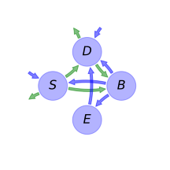
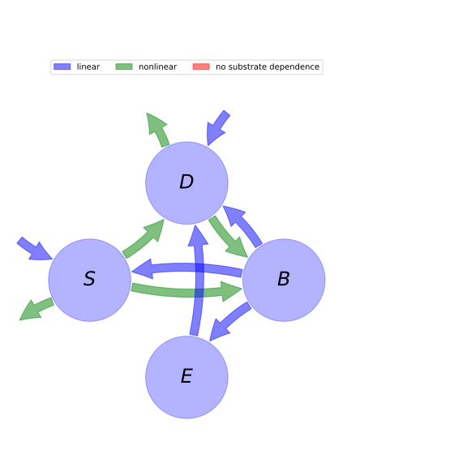

  
  
---
title: 'Report of the model: AWB, version: 1'
---
  
  
# General Overview  
  

 

This report is the result of the use of the python package bgc_md, as means to translate published models to a common language.  The underlying yaml file was created by Holger Metzler (Orcid ID: 0000-0002-8239-1601) on 17/03/2016.  
  
  
  
## About the model  
  
The model depicted in this document considers soil organic matter decomposition. It was originally described by @Allison2010NatureGeoscience.  
  
  
  
### Keywords  
  
differential equations, nonlinear, time variant, Michaelis-Menten
  
  
### Principles  
  
mass balance, substrate dependence of decomposition, heterogeneity of speed of decay, internal transformations of organic matter, environmental variability effects, substrate interactions
  
  
Name|Description|Unit  
:-----|:-----|:-----  
$S$|soil organic carbon pool|$mgC cm^{-3}$  
$D$|dissolved organic carbon pool|$mgC cm^{-3}$  
$B$|microbial biomass pool|$mgC cm^{-3}$  
$E$|enzyme pool|$mgC cm^{-3}$  
  Table: state_variables  
  
  
Name|Description|Unit  
:-----|:-----|:-----  
$r_{B}$|microbial biomass turnover rate|$h^{-1}$  
$r_{E}$|enzyme production rate|$h^{-1}$  
$r_{L}$|enzyme loss rate|$h^{-1}$  
$a_{BS}$|fraction of dead microbial biomass transferred to soil organic matter|-  
$V_{Umax}$|reference for maximum rate of dissolved organic carbon uptake|$h^{-1}$  
$V_{max}$|reference for maximum rate of soil organic carbon decomposition|$h^{-1}$  
$E_{aU}$|activation energy to convert substrate into product|$kJ mol^{-1}$  
$E_{a}$|activation energy for soil organic carbon decomposition|$kJ mol^{-1}$  
$\epsilon_{0}$|base carbon uptake efficiency|-  
$\epsilon_{s}$|carbon uptake efficieny slope|$°C^{-1}$  
$K_{U0}$|base half saturation constant for carbon uptkae|$mg C cm^{-3}$  
$K_{Us}$|half saturation constant slope for carbon uptake|$mg C cm^{-3} °C^{-1}$  
$K_{0}$|base half saturation constant for soil organic carbon decomposition|$mg C cm^{-3}$  
$K_{s}$|half saturation constant slope for soil organic carbon decomposition|$mg C cm^{-3} °C^{-1}$  
  Table: parameters  
  
  
Name|Description|Expression|Unit  
:-----|:-----|:-----:|:-----  
$t$|time|-|$hr$  
$T$|temperature|-|$°C$  
$V_{U}$|maximum dissolved organic carbon uptake rate|$V_{U}=V_{Umax}\cdot e^{-\frac{E_{aU}}{R\cdot\left(T + 273\right)}}$|-  
$V$|maximum decomosition rate of soil orgacic carbon|$V=V_{max}\cdot e^{-\frac{E_{a}}{R\cdot\left(T + 273\right)}}$|-  
$E_{C}$|carbon uptake efficiency|$E_{C}=T\cdot\epsilon_{s} +\epsilon_{0}$|-  
$K_{U}$|half saturation constant for carbon uptake|$K_{U}=K_{U0} + K_{Us}\cdot T$|$mg C cm^{-3}$  
$K$|half saturation constant for soil organic carbon decomposition|$K=K_{0} + K_{s}\cdot T$|$mg C cm^{-3}$  
  Table: additional_variables  
  
  
Name|Description|Expression  
:-----|:-----|:-----:  
$C$|carbon content|$C=\left[\begin{matrix}S\\D\\B\\E\end{matrix}\right]$  
$I$|input vector|$I=\left[\begin{matrix}I_{S}\\I_{D}\\0\\0\end{matrix}\right]$  
$T_{M}$|transition operator|$T_{M}=\left[\begin{matrix}-1 & 0 &\frac{a_{BS}\cdot r_{B}}{r_{B} + r_{E}} & 0\\1 & -1 &\frac{r_{B}\cdot\left(- a_{BS} + 1\right)}{r_{B} + r_{E}} & 1\\1 & E_{C} & -1 & 0\\0 & 0 &\frac{r_{E}}{r_{B} + r_{E}} & -1\end{matrix}\right]$  
$N$|decomposition operator|$N=\left[\begin{matrix}\frac{E\cdot V}{K + S} & 0 & 0 & 0\\0 &\frac{B\cdot V_{U}}{D + K_{U}} & 0 & 0\\0 & 0 & r_{B} + r_{E} & 0\\0 & 0 & 0 & r_{L}\end{matrix}\right]$  
$f_{s}$|the right hand side of the ode|$f_{s}=T_{M} N C + I$  
  Table: components  
  
  
## Pool model representation  
  

 

 **Figure 1:** *Pool model representation* 

  
  
#### Input fluxes  
  
$S: I_{S}$  
$D: I_{D}$  

  
  
#### Output fluxes  
  
$S: -\frac{E\cdot S\cdot V_{max}\cdot e^{-\frac{E_{a}}{0.008314\cdot T + 2.269722}}}{K_{0} + K_{s}\cdot T + S}$  
$D: -\frac{B\cdot D\cdot V_{Umax}\cdot e^{-\frac{E_{aU}}{0.008314\cdot T + 2.269722}}}{D + K_{U0} + K_{Us}\cdot T}\cdot\left(T\cdot\epsilon_{s} +\epsilon_{0} - 1\right)$  

  
  
#### Internal fluxes  
  
$S \rightarrow D: \frac{E\cdot S\cdot V_{max}\cdot e^{-\frac{E_{a}}{0.008314\cdot T + 2.269722}}}{K_{0} + K_{s}\cdot T + S}$  
$S \rightarrow B: \frac{E\cdot S\cdot V_{max}\cdot e^{-\frac{E_{a}}{0.008314\cdot T + 2.269722}}}{K_{0} + K_{s}\cdot T + S}$  
$D \rightarrow B: \frac{B\cdot D\cdot V_{Umax}\cdot e^{-\frac{E_{aU}}{0.008314\cdot T + 2.269722}}}{D + K_{U0} + K_{Us}\cdot T}\cdot\left(T\cdot\epsilon_{s} +\epsilon_{0}\right)$  
$B \rightarrow S: B\cdot a_{BS}\cdot r_{B}$  
$B \rightarrow D: B\cdot r_{B}\cdot\left(- a_{BS} + 1\right)$  
$B \rightarrow E: B\cdot r_{E}$  
$E \rightarrow D: E\cdot r_{L}$  
  
  
## References  
  
