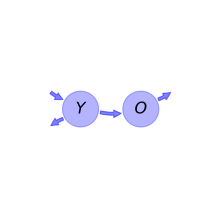
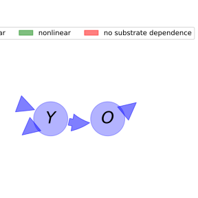

  
  
---
title: 'Report of the model: Introductory Carbon Balance Model (ICBM), version: 1'
---
  
  
# General Overview  
  

 

This report is the result of the use of the python package bgc_md, as means to translate published models to a common language.  The underlying yaml file was created by Holger Metzler (Orcid ID: 0000-0002-8239-1601) on 09/03/2016.  
  
  
  
## About the model  
  
The model depicted in this document considers soil organic matter decomposition. It was originally described by @Andren1997EcologicalApplications.  
  
  
  
### Keywords  
  
differential equations, linear, time invariant, analytic
  
  
### Principles  
  
mass balance, substrate dependence of decomposition, heterogeneity of speed of decay, internal transformations of organic matter, environmental variability effects
  
  
Name|Description|Unit  
:-----|:-----|:-----  
$Y$|young pool of soil carbon|$kgCm^{-2}$  
$O$|old pool of soil carbon|$kgCm^{-2}$  
  Table: state_variables  
The model section in the yaml file has no subsection: parameters.The model section in the yaml file has no subsection: additional_variables.  
  
Name|Description|Expression  
:-----|:-----|:-----:  
$C$|carbon content|$C=\left[\begin{matrix}Y\\O\end{matrix}\right]$  
$I$|input vector|$I=\left[\begin{matrix}i\\0\end{matrix}\right]$  
$\xi$|environmental effects multiplier|$\xi=r$  
$T$|transition operator|$T=\left[\begin{matrix}-1 & 0\\h & -1\end{matrix}\right]$  
$N$|decomposition operator|$N=\left[\begin{matrix}k_{1} & 0\\0 & k_{2}\end{matrix}\right]$  
$f_{s}$|the right hand side of the ode|$f_{s}=\xi T N C + I$  
  Table: components  
  
  
## Pool model representation  
  

 

 **Figure 1:** *Pool model representation* 

  
  
#### Input fluxes  
  
$Y: i$  

  
  
#### Output fluxes  
  
$Y: Y\cdot k_{1}\cdot r\cdot\left(- h + 1\right)$  
$O: O\cdot k_{2}\cdot r$  

  
  
#### Internal fluxes  
  
$Y \rightarrow O: Y\cdot h\cdot k_{1}\cdot r$  
  
  
## References  
  
