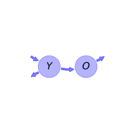
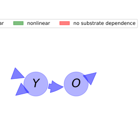

  
  
---
title: 'Report of the model: Introductory Carbon Balance Model (ICBM), version: 1'
---
  
  
# General Overview  
  

 

This report presents a general overview of the model ICBM , which is part of the Biogeochemistry Model Database BGC-MD.  The underlying yaml file entry that contains all the information of the model was created by Holger Metzler (Orcid ID: 0000-0002-8239-1601) on 09/03/2016. The entry was processed by the python package bgc-md to produce symbolic output.  
  
The model was originally described by @Andren1997EcologicalApplications.  
  
  
  
# Model description  
  
  
  
## State variables  
  
  
  
Name|Description|Unit  
:-----|:-----|:-----  
$Y$|young pool of soil carbon|$kgCm^{-2}$  
$O$|old pool of soil carbon|$kgCm^{-2}$  
  Table: state_variables  
  
  
## Components of the compartmental system  
  
  
  
Name|Description|Expression  
:-----|:-----|:-----:  
$C$|carbon content|$C=\left[\begin{matrix}Y\\O\end{matrix}\right]$  
$I$|input vector|$I=\left[\begin{matrix}i\\0\end{matrix}\right]$  
$\xi$|environmental effects multiplier|$\xi=r$  
$T$|transition operator|$T=\left[\begin{matrix}-1 & 0\\h & -1\end{matrix}\right]$  
$N$|decomposition operator|$N=\left[\begin{matrix}k_{1} & 0\\0 & k_{2}\end{matrix}\right]$  
$f_{s}$|the right hand side of the ode|$f_{s}=\xi T N C + I$  
  Table: components  
  
  
## Pool model representation  
  

 

 **Figure 1:** *Pool model representation* 

  
  
#### Input fluxes  
  
$Y: i$  

  
  
#### Output fluxes  
  
$Y: Y\cdot k_{1}\cdot r\cdot\left(- h + 1\right)$  
$O: O\cdot k_{2}\cdot r$  

  
  
#### Internal fluxes  
  
$Y \rightarrow O: Y\cdot h\cdot k_{1}\cdot r$  
  
  
## Steady state formulas  
  
$Y = \frac{i}{k_{1}\cdot r}$  
  
  
  
$O = \frac{h\cdot i}{k_{2}\cdot r}$  
  
  
  
  
  
# References  
  
